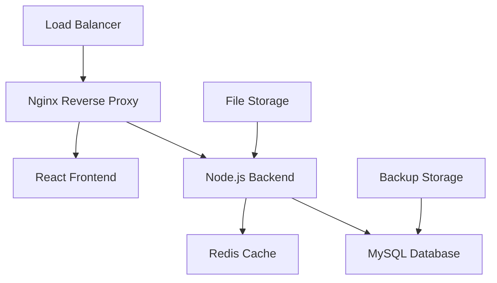

# Production Deployment Guide

This comprehensive guide covers deploying MedCare Pro Hospital Management System in production environments with proper security, performance optimization, and monitoring.

## 🏗️ Architecture Overview



## 🌐 VPS/Server Deployment

### Step 1: Server Preparation

#### Ubuntu/Debian Setup
```bash
# Update system packages
sudo apt update && sudo apt upgrade -y

# Install required packages
sudo apt install -y curl git nginx mysql-server redis-server

# Install Node.js 18+
curl -fsSL https://deb.nodesource.com/setup_18.x | sudo -E bash -
sudo apt install -y nodejs

# Verify installations
node --version  # Should be 18+
npm --version
mysql --version
```

#### CentOS/RHEL Setup
```bash
# Update system packages
sudo yum update -y

# Install EPEL repository
sudo yum install -y epel-release

# Install required packages
sudo yum install -y curl git nginx mysql-server redis

# Install Node.js 18+
curl -fsSL https://rpm.nodesource.com/setup_18.x | sudo bash -
sudo yum install -y nodejs
```

### Step 2: MySQL Database Setup

```bash
# Secure MySQL installation
sudo mysql_secure_installation

# Create database and user
sudo mysql -u root -p
```

```sql
-- Create database
CREATE DATABASE medcare_pro CHARACTER SET utf8mb4 COLLATE utf8mb4_unicode_ci;

-- Create user with proper privileges
CREATE USER 'medcare_user'@'localhost' IDENTIFIED BY 'your_secure_password';
GRANT ALL PRIVILEGES ON medcare_pro.* TO 'medcare_user'@'localhost';
FLUSH PRIVILEGES;
EXIT;
```

### Step 3: Application Deployment

```bash
# Create application directory
sudo mkdir -p /var/www/medcare-pro
sudo chown $USER:$USER /var/www/medcare-pro

# Clone or upload application files
cd /var/www/medcare-pro
# Upload your application files here

# Backend setup
cd server
npm install --production

# Copy and configure environment
cp .env.example .env
nano .env  # Edit with production settings
```

#### Production Environment Configuration
```env
# Production environment file
NODE_ENV=production
PORT=3333
APP_KEY=your_32_character_production_key

# Database
DB_HOST=localhost
DB_PORT=3306
DB_USER=medcare_user
DB_PASSWORD=your_secure_password
DB_DATABASE=medcare_pro

# Application URLs
APP_URL=https://yourdomain.com
FRONTEND_URL=https://yourdomain.com

# Email Configuration
MAIL_DRIVER=smtp
SMTP_HOST=your.smtp.server
SMTP_PORT=587
SMTP_USERNAME=noreply@yourdomain.com
SMTP_PASSWORD=your_email_password
MAIL_FROM_ADDRESS=noreply@yourdomain.com
MAIL_FROM_NAME="MedCare Pro"

# Security
SESSION_DRIVER=redis
REDIS_HOST=127.0.0.1
REDIS_PORT=6379

# File Storage
FILE_STORAGE_DRIVER=local
UPLOAD_MAX_SIZE=10mb
```

### Step 4: Database Migration and Setup

```bash
# Run database migrations
cd /var/www/medcare-pro/server
npm run build
node ace migration:run

# Seed initial data (optional)
node ace db:seed --files="SuperAdminSeeder"
```

### Step 5: Frontend Build

```bash
# Frontend setup and build
cd /var/www/medcare-pro
npm install
npm run build

# The built files will be in the 'dist' directory
```

### Step 6: Nginx Configuration

```bash
# Create Nginx configuration
sudo nano /etc/nginx/sites-available/medcare-pro
```

```nginx
# Nginx configuration for MedCare Pro
server {
    listen 80;
    server_name yourdomain.com www.yourdomain.com;
    return 301 https://$server_name$request_uri;
}

server {
    listen 443 ssl http2;
    server_name yourdomain.com www.yourdomain.com;
    
    # SSL Configuration
    ssl_certificate /etc/letsencrypt/live/yourdomain.com/fullchain.pem;
    ssl_certificate_key /etc/letsencrypt/live/yourdomain.com/privkey.pem;
    ssl_protocols TLSv1.2 TLSv1.3;
    ssl_ciphers HIGH:!aNULL:!MD5;
    
    # Security Headers
    add_header X-Frame-Options "SAMEORIGIN" always;
    add_header X-Content-Type-Options "nosniff" always;
    add_header X-XSS-Protection "1; mode=block" always;
    add_header Strict-Transport-Security "max-age=31536000; includeSubDomains" always;
    
    # Frontend (React)
    location / {
        root /var/www/medcare-pro/dist;
        try_files $uri $uri/ /index.html;
        
        # Browser caching for static assets
        location ~* \.(js|css|png|jpg|jpeg|gif|ico|svg|woff|woff2|ttf|eot)$ {
            expires 1y;
            add_header Cache-Control "public, immutable";
        }
    }
    
    # Backend API
    location /api {
        proxy_pass http://127.0.0.1:3333;
        proxy_http_version 1.1;
        proxy_set_header Upgrade $http_upgrade;
        proxy_set_header Connection 'upgrade';
        proxy_set_header Host $host;
        proxy_set_header X-Real-IP $remote_addr;
        proxy_set_header X-Forwarded-For $proxy_add_x_forwarded_for;
        proxy_set_header X-Forwarded-Proto $scheme;
        proxy_cache_bypass $http_upgrade;
        
        # Timeout settings
        proxy_connect_timeout 60s;
        proxy_send_timeout 60s;
        proxy_read_timeout 60s;
    }
    
    # WebSocket support (if needed)
    location /socket.io/ {
        proxy_pass http://127.0.0.1:3333;
        proxy_http_version 1.1;
        proxy_set_header Upgrade $http_upgrade;
        proxy_set_header Connection "upgrade";
        proxy_set_header Host $host;
        proxy_set_header X-Real-IP $remote_addr;
        proxy_set_header X-Forwarded-For $proxy_add_x_forwarded_for;
        proxy_set_header X-Forwarded-Proto $scheme;
    }
    
    # Upload size limit
    client_max_body_size 10M;
    
    # Gzip compression
    gzip on;
    gzip_types text/plain text/css application/json application/javascript text/xml application/xml application/xml+rss text/javascript;
}
```

```bash
# Enable the site
sudo ln -s /etc/nginx/sites-available/medcare-pro /etc/nginx/sites-enabled/
sudo nginx -t  # Test configuration
sudo systemctl reload nginx
```

### Step 7: SSL Certificate with Let's Encrypt

```bash
# Install Certbot
sudo apt install certbot python3-certbot-nginx

# Obtain SSL certificate
sudo certbot --nginx -d yourdomain.com -d www.yourdomain.com

# Test automatic renewal
sudo certbot renew --dry-run
```

### Step 8: Process Management with PM2

```bash
# Install PM2 globally
sudo npm install -g pm2

# Create PM2 ecosystem file
cd /var/www/medcare-pro/server
nano ecosystem.config.js
```

```javascript
// PM2 ecosystem configuration
module.exports = {
  apps: [{
    name: 'medcare-pro-api',
    script: './build/bin/server.js',
    instances: 'max',
    exec_mode: 'cluster',
    env: {
      NODE_ENV: 'production',
      PORT: 3333
    },
    error_file: '/var/log/medcare-pro/err.log',
    out_file: '/var/log/medcare-pro/out.log',
    log_file: '/var/log/medcare-pro/combined.log',
    time: true,
    max_memory_restart: '1G',
    autorestart: true,
    watch: false,
    max_restarts: 10,
    min_uptime: '10s'
  }]
};
```

```bash
# Create log directory
sudo mkdir -p /var/log/medcare-pro
sudo chown $USER:$USER /var/log/medcare-pro

# Start application with PM2
pm2 start ecosystem.config.js
pm2 save
pm2 startup  # Follow the instructions to enable auto-start
```

## ☁️ Cloud Deployment

### AWS Deployment

#### EC2 Instance Setup
```bash
# Launch EC2 instance (t3.medium or larger recommended)
# Use Ubuntu 20.04 LTS AMI
# Configure security groups:
# - HTTP (80) from 0.0.0.0/0
# - HTTPS (443) from 0.0.0.0/0
# - SSH (22) from your IP
# - MySQL (3306) from application servers only
```

#### RDS Database Setup
```bash
# Create RDS MySQL instance
# - Engine: MySQL 8.0
# - Instance class: db.t3.micro or larger
# - Storage: 20GB minimum
# - Backup retention: 7 days
# - Multi-AZ: Yes (for production)
```

#### S3 for File Storage
```bash
# Create S3 bucket for file uploads
# Configure CORS policy for uploads
# Set up IAM user with S3 access
```

### Azure Deployment

```bash
# Create Azure VM
az vm create \
  --resource-group medcare-pro-rg \
  --name medcare-pro-vm \
  --image UbuntuLTS \
  --size Standard_B2s \
  --admin-username azureuser \
  --generate-ssh-keys

# Create Azure Database for MySQL
az mysql server create \
  --resource-group medcare-pro-rg \
  --name medcare-pro-db \
  --location eastus \
  --admin-user medcareuser \
  --admin-password YourSecurePassword123 \
  --sku-name B_Gen5_1
```

### Google Cloud Platform

```bash
# Create Compute Engine instance
gcloud compute instances create medcare-pro-vm \
  --zone=us-central1-a \
  --machine-type=e2-medium \
  --image-family=ubuntu-2004-lts \
  --image-project=ubuntu-os-cloud

# Create Cloud SQL instance
gcloud sql instances create medcare-pro-db \
  --database-version=MYSQL_8_0 \
  --tier=db-f1-micro \
  --region=us-central1
```

## 🐳 Docker Deployment

### Docker Compose Configuration

```yaml
# docker-compose.prod.yml
version: '3.8'

services:
  frontend:
    build:
      context: .
      dockerfile: Dockerfile.frontend
    ports:
      - "80:80"
      - "443:443"
    volumes:
      - ./nginx.conf:/etc/nginx/nginx.conf
      - ./ssl:/etc/ssl/certs
    depends_on:
      - backend

  backend:
    build:
      context: ./server
      dockerfile: Dockerfile
    environment:
      NODE_ENV: production
      DB_HOST: database
      DB_USER: medcare_user
      DB_PASSWORD: ${DB_PASSWORD}
      DB_DATABASE: medcare_pro
      REDIS_HOST: redis
    depends_on:
      - database
      - redis
    volumes:
      - ./uploads:/app/uploads

  database:
    image: mysql:8.0
    environment:
      MYSQL_ROOT_PASSWORD: ${MYSQL_ROOT_PASSWORD}
      MYSQL_DATABASE: medcare_pro
      MYSQL_USER: medcare_user
      MYSQL_PASSWORD: ${DB_PASSWORD}
    volumes:
      - mysql_data:/var/lib/mysql
      - ./mysql-init:/docker-entrypoint-initdb.d
    ports:
      - "3306:3306"

  redis:
    image: redis:alpine
    volumes:
      - redis_data:/data

volumes:
  mysql_data:
  redis_data:
```

### Frontend Dockerfile
```dockerfile
# Dockerfile.frontend
FROM node:18-alpine as build

WORKDIR /app
COPY package*.json ./
RUN npm ci --only=production

COPY . .
RUN npm run build

FROM nginx:alpine
COPY --from=build /app/dist /usr/share/nginx/html
COPY nginx.conf /etc/nginx/nginx.conf
EXPOSE 80 443
CMD ["nginx", "-g", "daemon off;"]
```

### Backend Dockerfile
```dockerfile
# server/Dockerfile
FROM node:18-alpine

WORKDIR /app

COPY package*.json ./
RUN npm ci --only=production

COPY . .
RUN npm run build

EXPOSE 3333

CMD ["node", "build/bin/server.js"]
```

## 📊 Monitoring and Maintenance

### System Monitoring
```bash
# Install monitoring tools
sudo apt install htop iotop nethogs

# Set up log rotation
sudo nano /etc/logrotate.d/medcare-pro
```

```bash
# Log rotation configuration
/var/log/medcare-pro/*.log {
    daily
    missingok
    rotate 14
    compress
    delaycompress
    notifempty
    create 0644 ubuntu ubuntu
    postrotate
        pm2 reloadLogs
    endscript
}
```

### Database Backup Script
```bash
#!/bin/bash
# backup.sh - Daily database backup

DATE=$(date +%Y%m%d_%H%M%S)
BACKUP_DIR="/var/backups/medcare-pro"
DB_NAME="medcare_pro"
DB_USER="medcare_user"
DB_PASS="your_password"

mkdir -p $BACKUP_DIR

# Create backup
mysqldump -u $DB_USER -p$DB_PASS $DB_NAME | gzip > $BACKUP_DIR/backup_$DATE.sql.gz

# Clean old backups (keep 30 days)
find $BACKUP_DIR -name "backup_*.sql.gz" -mtime +30 -delete

# Upload to cloud storage (optional)
# aws s3 cp $BACKUP_DIR/backup_$DATE.sql.gz s3://your-backup-bucket/
```

### Automated Updates
```bash
# Create update script
#!/bin/bash
# update.sh - Application update script

cd /var/www/medcare-pro

# Backup database
./backup.sh

# Pull latest changes
git pull origin main

# Update dependencies
cd server && npm install --production
cd ../ && npm install

# Build frontend
npm run build

# Run migrations
cd server && node ace migration:run

# Restart application
pm2 restart all

echo "Update completed successfully"
```

## 🔒 Security Checklist

- [ ] SSL certificate installed and configured
- [ ] Firewall configured (UFW/iptables)
- [ ] Regular security updates scheduled
- [ ] Database access restricted
- [ ] Strong passwords enforced
- [ ] File permissions properly set
- [ ] Backup strategy implemented
- [ ] Monitoring and logging configured
- [ ] Rate limiting enabled
- [ ] CSRF protection enabled

## 🚨 Troubleshooting

### Common Issues

**Application won't start**
```bash
# Check PM2 logs
pm2 logs medcare-pro-api

# Check system logs
sudo journalctl -u nginx
sudo tail -f /var/log/mysql/error.log
```

**Database connection issues**
```bash
# Test database connection
mysql -u medcare_user -p medcare_pro

# Check MySQL status
sudo systemctl status mysql
```

**Performance issues**
```bash
# Monitor system resources
htop
iotop
df -h

# Check PM2 monitoring
pm2 monit
```

---

**Need deployment assistance?** Our technical team provides deployment support. Contact support@medcarepro.com for professional deployment services.
