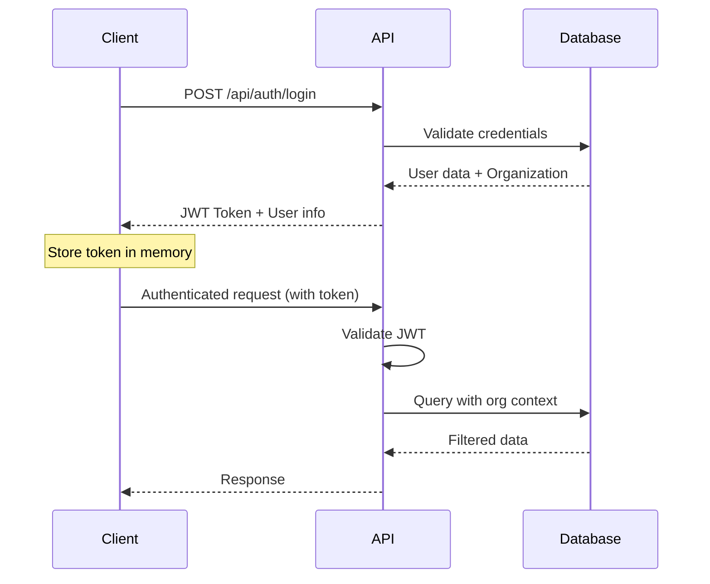

# System Architecture

## Overview

MedCare Pro is a modern hospital management system built with a **full-stack JavaScript/TypeScript architecture** featuring a React frontend, AdonisJS backend, and MySQL database. The system follows a **multi-tenant SaaS architecture** with role-based access control and organization-based data isolation.

## Technology Stack

### Frontend (Client-side)
- **Framework**: React 19 with TypeScript
- **Build Tool**: Vite 6.3.5
- **Styling**: TailwindCSS 4.1.11 with Radix UI components
- **State Management**: TanStack Query for server state management
- **Routing**: React Router DOM v7
- **Forms**: React Hook Form with Zod validation
- **Charts**: Recharts for data visualization
- **Icons**: Lucide React, Heroicons, Phosphor Icons

### Backend (Server-side)
- **Framework**: AdonisJS 6.18.0 with TypeScript
- **Database ORM**: Lucid (AdonisJS native ORM)
- **Authentication**: AdonisJS Auth with JWT tokens
- **Database**: MySQL 2 (mysql2 driver)
- **Validation**: VineJS 3.0.1
- **Security**: Helmet, CORS middleware
- **Real-time**: Socket.IO 4.8.1
- **File Storage**: AdonisJS Static files

### Database
- **Primary Database**: MySQL
- **Migration System**: AdonisJS Lucid migrations
- **Seeding**: Database seeders for initial data

## Architecture Patterns

### 1. Multi-Tenant SaaS Architecture

The system implements **organization-based multi-tenancy**:

```typescript
// Organization-based data isolation
class User extends BaseModel {
  @belongsTo(() => Organization)
  public organization: BelongsTo<typeof Organization>

  // All queries are automatically scoped by organization
  public static async query() {
    return super.query().where('organization_id', currentOrganization.id)
  }
}
```

**Key Features**:
- **Data Isolation**: Each organization's data is completely isolated
- **Super Admin Layer**: Super admin can manage multiple organizations
- **Subscription Management**: Built-in subscription and billing support
- **Role-based Access**: Granular permissions within each organization

### 2. Role-Based Access Control (RBAC)

The system implements a **flexible RBAC system** with dynamic role fields:

```typescript
// Dynamic role structure
interface Role {
  id: string
  name: string           // system name (e.g., 'doctor')
  displayName: string    // human readable (e.g., 'Doctor')
  organizationId: string // tenant isolation
  isSystemRole: boolean  // system vs custom roles
}

// Dynamic role fields for extensibility
interface RoleField {
  id: string
  roleId: string
  fieldName: string     // e.g., 'specialization'
  fieldType: string     // 'text', 'select', 'number', etc.
  isRequired: boolean
  isSystem: boolean     // protected system fields
}
```

**Built-in Roles**:
- **Super Admin**: Cross-organization management
- **Admin**: Organization-wide management
- **Doctor**: Medical staff with specialized data
- **Nurse**: Nursing staff
- **Receptionist**: Front desk operations
- **Billing**: Financial operations
- **Patient**: Patient portal access

### 3. Modular Frontend Architecture

The frontend follows a **feature-based modular architecture**:

```
src/
├── components/
│   ├── auth/              # Authentication components
│   ├── hospital/          # Core hospital management
│   │   ├── administration/    # Admin features
│   │   ├── appointments/      # Appointment management
│   │   ├── billing/          # Billing system
│   │   ├── dashboard/        # Dashboard widgets
│   │   ├── doctors/          # Doctor management
│   │   ├── facilities/       # Facility management
│   │   ├── inventory/        # Inventory management
│   │   ├── laboratory/       # Lab test management
│   │   ├── medical/          # Medical records
│   │   ├── notifications/    # Notification system
│   │   └── patients/         # Patient management
│   ├── superduparadmin/  # Super admin interface
│   └── ui/               # Reusable UI components
├── hooks/                # Custom React hooks
├── services/             # API services
└── router/               # Application routing
```

### 4. API Architecture

The backend follows **RESTful API principles** with **resource-based routing**:

```typescript
// Example API structure
router.group(() => {
  // Resource-based CRUD operations
  router.get('/patients', '#controllers/patients_controller.index')          // List patients
  router.get('/patients/:id', '#controllers/patients_controller.show')      // Get patient
  router.post('/patients', '#controllers/patients_controller.store')        // Create patient
  router.put('/patients/:id', '#controllers/patients_controller.update')    // Update patient
  router.delete('/patients/:id', '#controllers/patients_controller.destroy') // Delete patient
  
  // Specialized endpoints
  router.get('/patients/:id/medical-history', '#controllers/patients_controller.medicalHistory')
  router.get('/patients/:id/appointments', '#controllers/patients_controller.appointments')
}).prefix('/api').use(middleware.auth())
```

## Data Flow Architecture

### 1. Authentication Flow



### 2. Multi-tenant Data Access

```typescript
// Automatic organization scoping in models
export default class Patient extends BaseModel {
  @column()
  public organizationId: string

  @beforeFind()
  public static async scopeToOrganization(query: ModelQueryBuilderContract<typeof Patient>) {
    const auth = HttpContext.get()?.auth
    if (auth?.user?.organizationId) {
      query.where('organization_id', auth.user.organizationId)
    }
  }
}
```

### 3. Real-time Communication

The system uses **Socket.IO** for real-time features:

```typescript
// Real-time notifications
export default class NotificationService {
  public static async broadcast(organizationId: string, event: string, data: any) {
    const io = await import('#services/socket_service')
    io.to(`org_${organizationId}`).emit(event, data)
  }
}
```

## Security Architecture

### 1. Authentication & Authorization

- **JWT Tokens**: Stateless authentication
- **Role-based Permissions**: Granular access control
- **Organization Isolation**: Multi-tenant security
- **Token Refresh**: Automatic token renewal

### 2. Data Security

- **Input Validation**: VineJS schema validation
- **SQL Injection Protection**: ORM-based queries
- **XSS Protection**: Automatic output encoding
- **CORS Configuration**: Controlled cross-origin access

### 3. API Security

```typescript
// Security middleware stack
router.group(() => {
  // Routes here
}).use([
  middleware.auth(),        // Authentication check
  middleware.cors(),        // CORS headers
  middleware.rateLimit(),   // Rate limiting
])
```

## Database Architecture

### 1. Core Entities

The system manages these core entities:

- **Organizations**: Multi-tenant isolation
- **Users**: System users with roles
- **Patients**: Patient demographics and contacts
- **Appointments**: Scheduling and management
- **Medical Records**: Clinical data and history
- **Prescriptions**: Medication management
- **Lab Tests**: Laboratory test management
- **Billing**: Financial transactions
- **Inventory**: Supply and equipment management
- **Beds**: Facility management

### 2. Relationship Patterns

```sql
-- Core multi-tenant pattern
patients -> organizations (belongs_to)
users -> organizations (belongs_to)
appointments -> organizations (belongs_to via patient/doctor)

-- Clinical relationships
appointments -> patients (belongs_to)
appointments -> users (belongs_to, doctor)
medical_records -> patients (belongs_to)
prescriptions -> patients (belongs_to)
lab_tests -> patients (belongs_to)
```

### 3. Audit Trail

Every critical entity includes audit fields:

```typescript
export default class BaseModel extends LucidModel {
  @column.dateTime({ autoCreate: true })
  public createdAt: DateTime

  @column.dateTime({ autoCreate: true, autoUpdate: true })
  public updatedAt: DateTime

  @column.dateTime()
  public deletedAt: DateTime | null  // Soft delete support
}
```

## Scalability Considerations

### 1. Database Optimization

- **Indexed Queries**: All foreign keys and search fields indexed
- **Soft Deletes**: Data preservation for compliance
- **Query Optimization**: Eager loading and N+1 prevention

### 2. Frontend Performance

- **Code Splitting**: Route-based lazy loading
- **State Management**: Efficient server state with TanStack Query
- **Component Optimization**: React.memo and useMemo usage
- **Bundle Optimization**: Tree shaking and dead code elimination

### 3. Backend Performance

- **Connection Pooling**: Database connection management
- **Caching Strategy**: Query result caching (ready for Redis)
- **Middleware Optimization**: Efficient auth and validation
- **Background Jobs**: Planned for heavy operations

## Development Workflow

### 1. Code Organization

```typescript
// Example controller structure
export default class PatientsController {
  public async index({ request, response, auth }: HttpContext) {
    // 1. Validate request
    const validated = await request.validateUsing(/* schema */)
    
    // 2. Apply business logic
    const patients = await Patient.query()
      .where('organization_id', auth.user!.organizationId)
      .paginate(validated.page, validated.limit)
    
    // 3. Return standardized response
    return response.ok({
      success: true,
      data: patients,
      meta: { /* pagination */ }
    })
  }
}
```

### 2. Error Handling

```typescript
// Standardized error responses
export default class GlobalExceptionHandler {
  public async handle(error: unknown, ctx: HttpContext) {
    if (error instanceof ValidationException) {
      return ctx.response.badRequest({
        success: false,
        message: 'Validation failed',
        errors: error.messages
      })
    }
    
    return ctx.response.internalServerError({
      success: false,
      message: 'Internal server error'
    })
  }
}
```

## Current Implementation Status

### ✅ Completed Features

1. **Multi-tenant Architecture**: Full organization isolation
2. **Authentication System**: JWT-based with role management
3. **Core RBAC**: Dynamic roles and permissions
4. **Patient Management**: Complete CRUD with medical history
5. **Appointment System**: Scheduling, status management
6. **Medical Records**: Clinical data management
7. **Billing System**: Invoice and payment tracking
8. **Lab Management**: Test ordering and results
9. **Inventory Management**: Stock tracking and alerts
10. **Notification System**: Real-time alerts
11. **Dashboard Analytics**: Role-based dashboard views
12. **Super Admin Interface**: Cross-organization management

### 🚧 In Development

1. **Advanced Reporting**: Custom report builder
2. **Integration APIs**: HL7/FHIR compliance
3. **Mobile App**: React Native companion
4. **Advanced Analytics**: BI dashboard
5. **Telemedicine**: Video consultation features

### 📋 Planned Features

1. **Payment Gateway Integration**: Multiple payment providers
2. **Document Management**: File storage and versioning
3. **Backup & Restore**: Automated backup system
4. **Advanced Security**: 2FA, audit logging
5. **API Rate Limiting**: Enhanced DoS protection

This architecture provides a solid foundation for a scalable, secure, and maintainable hospital management system that can grow with organizational needs.
