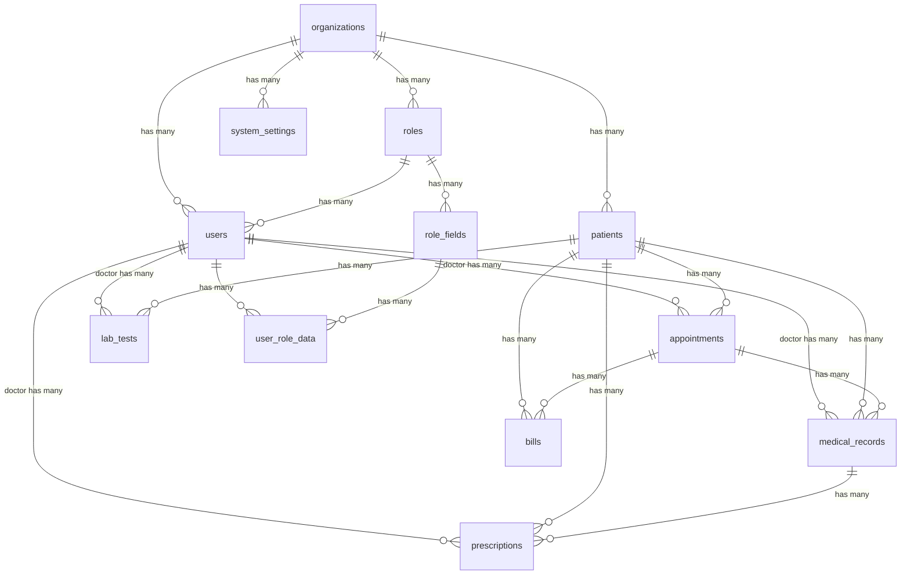

# Database Schema Reference

## Overview

This document provides a complete reference for the MedCare Pro database schema, including table structures, relationships, indexes, and data types. The database is designed with multi-tenant architecture, audit trails, and healthcare compliance in mind.

## Database Design Principles

### 1. Multi-Tenant Architecture
- **Organization-based isolation**: All core entities are scoped to organizations
- **Data segregation**: Automatic filtering by organization context
- **Shared infrastructure**: Single database instance with logical separation

### 2. Audit and Compliance
- **Soft deletes**: `deleted_at` timestamp for data preservation
- **Audit timestamps**: `created_at` and `updated_at` on all tables
- **Audit logging**: Separate audit trail for critical operations
- **Data integrity**: Foreign key constraints and validation

### 3. Scalability and Performance
- **UUID primary keys**: Globally unique identifiers
- **Strategic indexing**: Optimized for common query patterns
- **JSON columns**: Flexible storage for dynamic data
- **Connection pooling**: Efficient database connections

## Core Tables

### Organizations Table

The foundation table for multi-tenant architecture.

```sql
CREATE TABLE organizations (
  id CHAR(36) PRIMARY KEY,
  name VARCHAR(255) NOT NULL,
  type VARCHAR(50) NULL COMMENT 'hospital, clinic, pharmacy, laboratory',
  registration_number VARCHAR(100) NULL UNIQUE,
  address TEXT NULL,
  phone VARCHAR(20) NULL,
  email VARCHAR(191) NULL,
  website VARCHAR(255) NULL,
  status ENUM('active', 'inactive', 'suspended') DEFAULT 'active',
  settings JSON NULL COMMENT 'Organization-specific configuration',
  branding JSON NULL COMMENT 'Logo, colors, theme customization',
  timezone VARCHAR(50) DEFAULT 'UTC',
  currency VARCHAR(3) DEFAULT 'USD',
  language VARCHAR(5) DEFAULT 'en',
  created_at TIMESTAMP NOT NULL,
  updated_at TIMESTAMP NOT NULL,
  
  INDEX idx_organizations_name (name),
  INDEX idx_organizations_type (type),
  INDEX idx_organizations_status (status),
  UNIQUE INDEX idx_organizations_registration (registration_number)
);
```

**Sample Data:**
```json
{
  "id": "org-123e4567-e89b-12d3-a456-426614174000",
  "name": "City General Hospital",
  "type": "hospital",
  "registration_number": "HOS-2024-001",
  "address": "123 Medical Center Drive, City, State 12345",
  "phone": "+1-555-0123",
  "email": "info@citygeneral.com",
  "settings": {
    "appointmentDuration": 30,
    "workingHours": {"start": "08:00", "end": "18:00"},
    "features": {"telemedicine": true, "labIntegration": false}
  },
  "branding": {
    "logo": "/uploads/logos/city-general.png",
    "primaryColor": "#1e40af",
    "secondaryColor": "#64748b"
  }
}
```

### Users Table

Central user management with role-based access control.

```sql
CREATE TABLE users (
  id CHAR(36) PRIMARY KEY,
  email VARCHAR(191) UNIQUE NOT NULL,
  password_hash VARCHAR(255) NOT NULL,
  name VARCHAR(255) NOT NULL,
  organization_id CHAR(36) NULL,
  role_id CHAR(36) NULL,
  is_active BOOLEAN DEFAULT TRUE,
  is_demo BOOLEAN DEFAULT FALSE,
  email_verified_at TIMESTAMP NULL,
  last_login_at TIMESTAMP NULL,
  created_at TIMESTAMP NOT NULL,
  updated_at TIMESTAMP NOT NULL,
  deleted_at TIMESTAMP NULL,
  
  FOREIGN KEY (organization_id) REFERENCES organizations(id) ON DELETE CASCADE,
  FOREIGN KEY (role_id) REFERENCES roles(id) ON DELETE SET NULL,
  
  INDEX idx_users_email (email),
  INDEX idx_users_organization (organization_id),
  INDEX idx_users_role (role_id),
  INDEX idx_users_active (is_active),
  INDEX idx_users_deleted (deleted_at)
);
```

### Roles Table

Dynamic role system supporting custom roles and permissions.

```sql
CREATE TABLE roles (
  id CHAR(36) PRIMARY KEY,
  name VARCHAR(100) NOT NULL COMMENT 'System identifier (e.g., doctor, nurse)',
  display_name VARCHAR(255) NOT NULL COMMENT 'Human-readable name',
  description TEXT NULL,
  permissions JSON NULL COMMENT 'Role-specific permissions',
  organization_id CHAR(36) NULL COMMENT 'NULL for system roles',
  is_system_role BOOLEAN DEFAULT FALSE COMMENT 'Protected system roles',
  is_active BOOLEAN DEFAULT TRUE,
  created_at TIMESTAMP NOT NULL,
  updated_at TIMESTAMP NOT NULL,
  
  FOREIGN KEY (organization_id) REFERENCES organizations(id) ON DELETE CASCADE,
  
  UNIQUE INDEX idx_roles_name_org (name, organization_id),
  INDEX idx_roles_organization (organization_id),
  INDEX idx_roles_system (is_system_role),
  INDEX idx_roles_active (is_active)
);
```

**Default System Roles:**
```json
[
  {
    "name": "super_admin",
    "display_name": "Super Administrator",
    "permissions": {"*": ["*"]},
    "organization_id": null,
    "is_system_role": true
  },
  {
    "name": "admin",
    "display_name": "Administrator",
    "permissions": {
      "users": ["read", "write", "delete"],
      "patients": ["read", "write", "delete"],
      "reports": ["read", "generate"]
    },
    "is_system_role": true
  },
  {
    "name": "doctor",
    "display_name": "Doctor",
    "permissions": {
      "patients": ["read", "write"],
      "appointments": ["read", "write"],
      "medical_records": ["read", "write"],
      "prescriptions": ["read", "write"]
    },
    "is_system_role": true
  }
]
```

### Role Fields Table

Dynamic fields for extensible user profiles based on roles.

```sql
CREATE TABLE role_fields (
  id CHAR(36) PRIMARY KEY,
  role_id CHAR(36) NOT NULL,
  field_name VARCHAR(100) NOT NULL COMMENT 'Field identifier',
  field_label VARCHAR(255) NOT NULL COMMENT 'Display label',
  field_type ENUM('text', 'email', 'number', 'decimal', 'boolean', 'date', 'datetime', 'select', 'multi_select', 'textarea', 'file', 'phone', 'url') NOT NULL,
  field_options JSON NULL COMMENT 'Options for select fields',
  is_required BOOLEAN DEFAULT FALSE,
  sort_order INTEGER DEFAULT 0,
  is_active BOOLEAN DEFAULT TRUE,
  is_system_field BOOLEAN DEFAULT FALSE COMMENT 'Protected system fields',
  description TEXT NULL,
  validation_rules JSON NULL COMMENT 'Custom validation rules',
  created_at TIMESTAMP NOT NULL,
  updated_at TIMESTAMP NOT NULL,
  
  FOREIGN KEY (role_id) REFERENCES roles(id) ON DELETE CASCADE,
  
  UNIQUE INDEX idx_role_fields_role_name (role_id, field_name),
  INDEX idx_role_fields_role (role_id),
  INDEX idx_role_fields_active (is_active)
);
```

**Example Doctor Role Fields:**
```json
[
  {
    "field_name": "specialization",
    "field_label": "Medical Specialization",
    "field_type": "select",
    "field_options": {
      "options": [
        {"value": "cardiology", "label": "Cardiology"},
        {"value": "neurology", "label": "Neurology"},
        {"value": "orthopedics", "label": "Orthopedics"}
      ]
    },
    "is_required": true
  },
  {
    "field_name": "license_number",
    "field_label": "Medical License Number",
    "field_type": "text",
    "validation_rules": {
      "pattern": "^[A-Z0-9]{6,12}$",
      "message": "License must be 6-12 alphanumeric characters"
    },
    "is_required": true
  }
]
```

### User Role Data Table

Stores dynamic role-specific data for users.

```sql
CREATE TABLE user_role_data (
  id CHAR(36) PRIMARY KEY,
  user_id CHAR(36) NOT NULL,
  role_field_id CHAR(36) NOT NULL,
  field_value TEXT NULL,
  created_at TIMESTAMP NOT NULL,
  updated_at TIMESTAMP NOT NULL,
  
  FOREIGN KEY (user_id) REFERENCES users(id) ON DELETE CASCADE,
  FOREIGN KEY (role_field_id) REFERENCES role_fields(id) ON DELETE CASCADE,
  
  UNIQUE INDEX idx_user_role_data_user_field (user_id, role_field_id),
  INDEX idx_user_role_data_user (user_id)
);
```

## Patient Management Tables

### Patients Table

Core patient demographics and medical information.

```sql
CREATE TABLE patients (
  id CHAR(36) PRIMARY KEY,
  patient_id CHAR(36) UNIQUE NOT NULL COMMENT 'Business identifier',
  name VARCHAR(255) NOT NULL,
  phone VARCHAR(20) NOT NULL,
  email VARCHAR(191) NULL,
  date_of_birth DATE NOT NULL,
  gender ENUM('male', 'female', 'other') NOT NULL,
  address TEXT NOT NULL,
  emergency_contact JSON NOT NULL COMMENT 'Contact information object',
  blood_group ENUM('A+', 'A-', 'B+', 'B-', 'AB+', 'AB-', 'O+', 'O-') NULL,
  allergies JSON NULL COMMENT 'Array of allergy strings',
  chronic_conditions JSON NULL COMMENT 'Array of chronic conditions',
  vaccination_records JSON NULL COMMENT 'Vaccination history',
  insurance_info JSON NULL COMMENT 'Insurance details',
  organization_id CHAR(36) NOT NULL,
  created_at TIMESTAMP NOT NULL,
  updated_at TIMESTAMP NOT NULL,
  deleted_at TIMESTAMP NULL,
  
  FOREIGN KEY (organization_id) REFERENCES organizations(id) ON DELETE CASCADE,
  
  UNIQUE INDEX idx_patients_patient_id (patient_id),
  INDEX idx_patients_name (name),
  INDEX idx_patients_phone (phone),
  INDEX idx_patients_email (email),
  INDEX idx_patients_organization (organization_id),
  INDEX idx_patients_deleted (deleted_at)
);
```

**Sample Patient Record:**
```json
{
  "id": "pat-123e4567-e89b-12d3-a456-426614174000",
  "patient_id": "P-2024-001",
  "name": "John Doe",
  "phone": "+1-555-0123",
  "email": "john.doe@email.com",
  "date_of_birth": "1990-01-15",
  "gender": "male",
  "emergency_contact": {
    "name": "Jane Doe",
    "relationship": "spouse",
    "phone": "+1-555-0124",
    "email": "jane.doe@email.com"
  },
  "blood_group": "O+",
  "allergies": ["Penicillin", "Shellfish"],
  "chronic_conditions": ["Hypertension"],
  "insurance_info": {
    "provider": "Blue Cross Blue Shield",
    "policy_number": "BC123456789",
    "group_number": "GRP001"
  }
}
```

### Appointments Table

Appointment scheduling and management.

```sql
CREATE TABLE appointments (
  id CHAR(36) PRIMARY KEY,
  appointment_id CHAR(36) UNIQUE NOT NULL,
  patient_id CHAR(36) NOT NULL,
  doctor_id CHAR(36) NOT NULL COMMENT 'References users table',
  appointment_date TIMESTAMP NOT NULL,
  appointment_time TIMESTAMP NOT NULL,
  duration INTEGER NOT NULL COMMENT 'Duration in minutes',
  status ENUM('scheduled', 'confirmed', 'checked_in', 'in_progress', 'completed', 'cancelled', 'no_show') DEFAULT 'scheduled',
  type VARCHAR(100) NOT NULL COMMENT 'consultation, follow_up, emergency',
  priority ENUM('low', 'normal', 'high', 'urgent') DEFAULT 'normal',
  reason TEXT NOT NULL,
  notes TEXT NULL,
  symptoms JSON NULL COMMENT 'Array of symptoms',
  vitals JSON NULL COMMENT 'Vital signs recorded',
  checked_in_at TIMESTAMP NULL,
  checked_out_at TIMESTAMP NULL,
  room_number VARCHAR(50) NULL,
  organization_id CHAR(36) NOT NULL,
  created_at TIMESTAMP NOT NULL,
  updated_at TIMESTAMP NOT NULL,
  
  FOREIGN KEY (patient_id) REFERENCES patients(id) ON DELETE CASCADE,
  FOREIGN KEY (doctor_id) REFERENCES users(id) ON DELETE CASCADE,
  FOREIGN KEY (organization_id) REFERENCES organizations(id) ON DELETE CASCADE,
  
  INDEX idx_appointments_patient (patient_id),
  INDEX idx_appointments_doctor (doctor_id),
  INDEX idx_appointments_date (appointment_date),
  INDEX idx_appointments_status (status),
  INDEX idx_appointments_organization (organization_id),
  INDEX idx_appointments_type (type)
);
```

### Medical Records Table

Clinical documentation and medical history.

```sql
CREATE TABLE medical_records (
  id CHAR(36) PRIMARY KEY,
  record_id CHAR(36) UNIQUE NOT NULL,
  patient_id CHAR(36) NOT NULL,
  doctor_id CHAR(36) NOT NULL,
  appointment_id CHAR(36) NULL,
  visit_date TIMESTAMP NOT NULL,
  chief_complaint TEXT NULL,
  history_of_present_illness TEXT NULL,
  past_medical_history JSON NULL,
  family_history JSON NULL,
  social_history JSON NULL,
  allergies JSON NULL,
  medications JSON NULL,
  physical_examination JSON NULL,
  vital_signs JSON NULL COMMENT 'Temperature, BP, heart rate, etc.',
  assessment TEXT NULL,
  diagnosis JSON NULL COMMENT 'Array of diagnoses',
  treatment_plan TEXT NULL,
  procedures_performed JSON NULL,
  lab_results JSON NULL,
  imaging_results JSON NULL,
  follow_up_instructions TEXT NULL,
  notes TEXT NULL,
  is_confidential BOOLEAN DEFAULT FALSE,
  organization_id CHAR(36) NOT NULL,
  created_at TIMESTAMP NOT NULL,
  updated_at TIMESTAMP NOT NULL,
  
  FOREIGN KEY (patient_id) REFERENCES patients(id) ON DELETE CASCADE,
  FOREIGN KEY (doctor_id) REFERENCES users(id) ON DELETE CASCADE,
  FOREIGN KEY (appointment_id) REFERENCES appointments(id) ON DELETE SET NULL,
  FOREIGN KEY (organization_id) REFERENCES organizations(id) ON DELETE CASCADE,
  
  INDEX idx_medical_records_patient (patient_id),
  INDEX idx_medical_records_doctor (doctor_id),
  INDEX idx_medical_records_appointment (appointment_id),
  INDEX idx_medical_records_visit_date (visit_date),
  INDEX idx_medical_records_organization (organization_id)
);
```

**Sample Medical Record:**
```json
{
  "vital_signs": {
    "temperature": "98.6°F",
    "blood_pressure": "120/80 mmHg",
    "heart_rate": "72 bpm",
    "respiratory_rate": "16/min",
    "oxygen_saturation": "98%",
    "weight": "180 lbs",
    "height": "5'10\""
  },
  "physical_examination": {
    "general": "Alert and oriented, no acute distress",
    "cardiovascular": "Regular rate and rhythm, no murmurs",
    "respiratory": "Clear to auscultation bilaterally",
    "neurological": "Grossly intact"
  },
  "diagnosis": [
    {
      "code": "I10",
      "description": "Essential hypertension",
      "type": "primary"
    }
  ]
}
```

## Clinical Management Tables

### Prescriptions Table

Medication prescriptions and management.

```sql
CREATE TABLE prescriptions (
  id CHAR(36) PRIMARY KEY,
  prescription_id CHAR(36) UNIQUE NOT NULL,
  patient_id CHAR(36) NOT NULL,
  doctor_id CHAR(36) NOT NULL,
  appointment_id CHAR(36) NULL,
  medical_record_id CHAR(36) NULL,
  medications JSON NOT NULL COMMENT 'Array of medication objects',
  instructions TEXT NULL,
  valid_until DATE NULL,
  status ENUM('active', 'dispensed', 'expired', 'cancelled') DEFAULT 'active',
  dispensed_at TIMESTAMP NULL,
  dispensed_by CHAR(36) NULL COMMENT 'User who dispensed',
  pharmacy_notes TEXT NULL,
  organization_id CHAR(36) NOT NULL,
  created_at TIMESTAMP NOT NULL,
  updated_at TIMESTAMP NOT NULL,
  
  FOREIGN KEY (patient_id) REFERENCES patients(id) ON DELETE CASCADE,
  FOREIGN KEY (doctor_id) REFERENCES users(id) ON DELETE CASCADE,
  FOREIGN KEY (appointment_id) REFERENCES appointments(id) ON DELETE SET NULL,
  FOREIGN KEY (medical_record_id) REFERENCES medical_records(id) ON DELETE SET NULL,
  FOREIGN KEY (dispensed_by) REFERENCES users(id) ON DELETE SET NULL,
  FOREIGN KEY (organization_id) REFERENCES organizations(id) ON DELETE CASCADE,
  
  INDEX idx_prescriptions_patient (patient_id),
  INDEX idx_prescriptions_doctor (doctor_id),
  INDEX idx_prescriptions_status (status),
  INDEX idx_prescriptions_organization (organization_id)
);
```

**Sample Prescription Data:**
```json
{
  "medications": [
    {
      "name": "Lisinopril",
      "dosage": "10mg",
      "frequency": "Once daily",
      "duration": "30 days",
      "instructions": "Take with or without food",
      "quantity": 30,
      "refills": 5
    },
    {
      "name": "Metformin",
      "dosage": "500mg",
      "frequency": "Twice daily",
      "duration": "90 days",
      "instructions": "Take with meals",
      "quantity": 180,
      "refills": 2
    }
  ]
}
```

### Lab Tests Table

Laboratory test orders and results.

```sql
CREATE TABLE lab_tests (
  id CHAR(36) PRIMARY KEY,
  test_id CHAR(36) UNIQUE NOT NULL,
  patient_id CHAR(36) NOT NULL,
  doctor_id CHAR(36) NOT NULL,
  appointment_id CHAR(36) NULL,
  test_name VARCHAR(255) NOT NULL,
  test_category VARCHAR(100) NULL,
  test_code VARCHAR(50) NULL,
  specimen_type VARCHAR(100) NULL,
  collection_date TIMESTAMP NULL,
  report_date TIMESTAMP NULL,
  status ENUM('ordered', 'collected', 'in_progress', 'completed', 'cancelled') DEFAULT 'ordered',
  priority ENUM('routine', 'urgent', 'stat') DEFAULT 'routine',
  results JSON NULL COMMENT 'Test results data',
  reference_ranges JSON NULL COMMENT 'Normal value ranges',
  interpretation TEXT NULL,
  notes TEXT NULL,
  technician_id CHAR(36) NULL COMMENT 'Lab technician',
  verified_by CHAR(36) NULL COMMENT 'Verifying doctor/supervisor',
  organization_id CHAR(36) NOT NULL,
  created_at TIMESTAMP NOT NULL,
  updated_at TIMESTAMP NOT NULL,
  
  FOREIGN KEY (patient_id) REFERENCES patients(id) ON DELETE CASCADE,
  FOREIGN KEY (doctor_id) REFERENCES users(id) ON DELETE CASCADE,
  FOREIGN KEY (appointment_id) REFERENCES appointments(id) ON DELETE SET NULL,
  FOREIGN KEY (technician_id) REFERENCES users(id) ON DELETE SET NULL,
  FOREIGN KEY (verified_by) REFERENCES users(id) ON DELETE SET NULL,
  FOREIGN KEY (organization_id) REFERENCES organizations(id) ON DELETE CASCADE,
  
  INDEX idx_lab_tests_patient (patient_id),
  INDEX idx_lab_tests_doctor (doctor_id),
  INDEX idx_lab_tests_status (status),
  INDEX idx_lab_tests_collection_date (collection_date),
  INDEX idx_lab_tests_organization (organization_id)
);
```

**Sample Lab Results:**
```json
{
  "results": [
    {
      "parameter": "Hemoglobin",
      "value": 14.2,
      "unit": "g/dL",
      "reference_range": "12.0-15.5",
      "flag": "normal"
    },
    {
      "parameter": "White Blood Cell Count",
      "value": 8.5,
      "unit": "×10³/μL",
      "reference_range": "4.5-11.0",
      "flag": "normal"
    },
    {
      "parameter": "Glucose",
      "value": 180,
      "unit": "mg/dL", 
      "reference_range": "70-99",
      "flag": "high"
    }
  ]
}
```

## Financial Management Tables

### Bills Table

Billing and invoicing management.

```sql
CREATE TABLE bills (
  id CHAR(36) PRIMARY KEY,
  bill_id CHAR(36) UNIQUE NOT NULL,
  patient_id CHAR(36) NOT NULL,
  appointment_id CHAR(36) NULL,
  bill_date DATE NOT NULL,
  due_date DATE NULL,
  items JSON NOT NULL COMMENT 'Array of billing items',
  subtotal DECIMAL(10,2) NOT NULL,
  tax_amount DECIMAL(10,2) DEFAULT 0.00,
  discount_amount DECIMAL(10,2) DEFAULT 0.00,
  total_amount DECIMAL(10,2) NOT NULL,
  paid_amount DECIMAL(10,2) DEFAULT 0.00,
  balance_amount DECIMAL(10,2) NOT NULL,
  status ENUM('draft', 'sent', 'paid', 'overdue', 'cancelled') DEFAULT 'draft',
  payment_method VARCHAR(50) NULL,
  payment_reference VARCHAR(255) NULL,
  payment_date TIMESTAMP NULL,
  notes TEXT NULL,
  organization_id CHAR(36) NOT NULL,
  created_at TIMESTAMP NOT NULL,
  updated_at TIMESTAMP NOT NULL,
  
  FOREIGN KEY (patient_id) REFERENCES patients(id) ON DELETE CASCADE,
  FOREIGN KEY (appointment_id) REFERENCES appointments(id) ON DELETE SET NULL,
  FOREIGN KEY (organization_id) REFERENCES organizations(id) ON DELETE CASCADE,
  
  INDEX idx_bills_patient (patient_id),
  INDEX idx_bills_bill_date (bill_date),
  INDEX idx_bills_due_date (due_date),
  INDEX idx_bills_status (status),
  INDEX idx_bills_organization (organization_id)
);
```

**Sample Bill Items:**
```json
{
  "items": [
    {
      "description": "Doctor Consultation",
      "code": "CONSULT-001",
      "quantity": 1,
      "unit_price": 150.00,
      "total": 150.00
    },
    {
      "description": "Blood Test - Complete Blood Count",
      "code": "LAB-CBC-001",
      "quantity": 1,
      "unit_price": 75.00,
      "total": 75.00
    },
    {
      "description": "Prescription Fee",
      "code": "RX-FEE",
      "quantity": 1,
      "unit_price": 25.00,
      "total": 25.00
    }
  ]
}
```

## Facility Management Tables

### Beds Table

Hospital bed and room management.

```sql
CREATE TABLE beds (
  id CHAR(36) PRIMARY KEY,
  bed_number VARCHAR(50) NOT NULL,
  room_number VARCHAR(50) NOT NULL,
  ward VARCHAR(100) NULL,
  bed_type ENUM('general', 'private', 'icu', 'emergency', 'maternity') NOT NULL,
  status ENUM('available', 'occupied', 'maintenance', 'out_of_service') DEFAULT 'available',
  patient_id CHAR(36) NULL COMMENT 'Currently assigned patient',
  assigned_at TIMESTAMP NULL,
  discharge_expected_at TIMESTAMP NULL,
  daily_rate DECIMAL(8,2) NULL,
  amenities JSON NULL COMMENT 'Array of amenities',
  notes TEXT NULL,
  organization_id CHAR(36) NOT NULL,
  created_at TIMESTAMP NOT NULL,
  updated_at TIMESTAMP NOT NULL,
  
  FOREIGN KEY (patient_id) REFERENCES patients(id) ON DELETE SET NULL,
  FOREIGN KEY (organization_id) REFERENCES organizations(id) ON DELETE CASCADE,
  
  UNIQUE INDEX idx_beds_bed_number_org (bed_number, organization_id),
  INDEX idx_beds_status (status),
  INDEX idx_beds_room (room_number),
  INDEX idx_beds_patient (patient_id),
  INDEX idx_beds_organization (organization_id)
);
```

### Inventory Table

Medical supply and equipment inventory.

```sql
CREATE TABLE inventories (
  id CHAR(36) PRIMARY KEY,
  item_code VARCHAR(100) NOT NULL,
  item_name VARCHAR(255) NOT NULL,
  category VARCHAR(100) NULL,
  subcategory VARCHAR(100) NULL,
  description TEXT NULL,
  unit_of_measure VARCHAR(50) NULL,
  current_stock INTEGER NOT NULL DEFAULT 0,
  minimum_stock INTEGER DEFAULT 0,
  maximum_stock INTEGER NULL,
  reorder_level INTEGER NULL,
  unit_cost DECIMAL(10,2) NULL,
  supplier_info JSON NULL,
  expiry_date DATE NULL,
  batch_number VARCHAR(100) NULL,
  location VARCHAR(255) NULL,
  barcode VARCHAR(255) NULL,
  is_active BOOLEAN DEFAULT TRUE,
  organization_id CHAR(36) NOT NULL,
  created_at TIMESTAMP NOT NULL,
  updated_at TIMESTAMP NOT NULL,
  
  FOREIGN KEY (organization_id) REFERENCES organizations(id) ON DELETE CASCADE,
  
  UNIQUE INDEX idx_inventories_item_code_org (item_code, organization_id),
  INDEX idx_inventories_category (category),
  INDEX idx_inventories_stock_level (current_stock),
  INDEX idx_inventories_expiry (expiry_date),
  INDEX idx_inventories_organization (organization_id)
);
```

## System and Support Tables

### Master Data Table

Configurable dropdown and reference data.

```sql
CREATE TABLE master_data (
  id CHAR(36) PRIMARY KEY,
  category VARCHAR(100) NOT NULL COMMENT 'e.g., specializations, departments',
  code VARCHAR(100) NOT NULL COMMENT 'Unique code within category',
  name VARCHAR(255) NOT NULL COMMENT 'Display name',
  description TEXT NULL,
  sort_order INTEGER DEFAULT 0,
  is_active BOOLEAN DEFAULT TRUE,
  metadata JSON NULL COMMENT 'Additional category-specific data',
  organization_id CHAR(36) NULL COMMENT 'NULL for global data',
  created_at TIMESTAMP NOT NULL,
  updated_at TIMESTAMP NOT NULL,
  
  FOREIGN KEY (organization_id) REFERENCES organizations(id) ON DELETE CASCADE,
  
  UNIQUE INDEX idx_master_data_code_category_org (category, code, organization_id),
  INDEX idx_master_data_category (category),
  INDEX idx_master_data_active (is_active),
  INDEX idx_master_data_organization (organization_id)
);
```

### System Settings Table

Application configuration settings.

```sql
CREATE TABLE system_settings (
  id CHAR(36) PRIMARY KEY,
  key_name VARCHAR(100) NOT NULL,
  key_value TEXT NULL,
  data_type ENUM('string', 'number', 'boolean', 'json') DEFAULT 'string',
  category VARCHAR(100) NULL,
  description TEXT NULL,
  is_public BOOLEAN DEFAULT FALSE COMMENT 'Accessible to frontend',
  organization_id CHAR(36) NULL COMMENT 'NULL for global settings',
  created_at TIMESTAMP NOT NULL,
  updated_at TIMESTAMP NOT NULL,
  
  FOREIGN KEY (organization_id) REFERENCES organizations(id) ON DELETE CASCADE,
  
  UNIQUE INDEX idx_system_settings_key_org (key_name, organization_id),
  INDEX idx_system_settings_category (category),
  INDEX idx_system_settings_public (is_public),
  INDEX idx_system_settings_organization (organization_id)
);
```

### Notifications Table

System notifications and alerts.

```sql
CREATE TABLE notifications (
  id CHAR(36) PRIMARY KEY,
  user_id CHAR(36) NOT NULL,
  title VARCHAR(255) NOT NULL,
  message TEXT NOT NULL,
  type ENUM('info', 'success', 'warning', 'error') DEFAULT 'info',
  category VARCHAR(100) NULL,
  data JSON NULL COMMENT 'Additional notification data',
  is_read BOOLEAN DEFAULT FALSE,
  read_at TIMESTAMP NULL,
  expires_at TIMESTAMP NULL,
  organization_id CHAR(36) NOT NULL,
  created_at TIMESTAMP NOT NULL,
  updated_at TIMESTAMP NOT NULL,
  
  FOREIGN KEY (user_id) REFERENCES users(id) ON DELETE CASCADE,
  FOREIGN KEY (organization_id) REFERENCES organizations(id) ON DELETE CASCADE,
  
  INDEX idx_notifications_user (user_id),
  INDEX idx_notifications_read (is_read),
  INDEX idx_notifications_type (type),
  INDEX idx_notifications_organization (organization_id)
);
```

## Scheduling Tables

### Doctor Schedules Table

Weekly schedule templates for doctors.

```sql
CREATE TABLE doctor_schedules (
  id CHAR(36) PRIMARY KEY,
  doctor_id CHAR(36) NOT NULL COMMENT 'References users table',
  day_of_week ENUM('monday', 'tuesday', 'wednesday', 'thursday', 'friday', 'saturday', 'sunday') NOT NULL,
  start_time TIME NOT NULL,
  end_time TIME NOT NULL,
  slot_duration INTEGER DEFAULT 30 COMMENT 'Minutes per appointment slot',
  is_available BOOLEAN DEFAULT TRUE,
  organization_id CHAR(36) NOT NULL,
  created_at TIMESTAMP NOT NULL,
  updated_at TIMESTAMP NOT NULL,
  
  FOREIGN KEY (doctor_id) REFERENCES users(id) ON DELETE CASCADE,
  FOREIGN KEY (organization_id) REFERENCES organizations(id) ON DELETE CASCADE,
  
  UNIQUE INDEX idx_doctor_schedules_doctor_day (doctor_id, day_of_week),
  INDEX idx_doctor_schedules_doctor (doctor_id),
  INDEX idx_doctor_schedules_organization (organization_id)
);
```

### Doctor Availability Table

Specific date availability overrides.

```sql
CREATE TABLE doctor_availability (
  id CHAR(36) PRIMARY KEY,
  doctor_id CHAR(36) NOT NULL,
  availability_date DATE NOT NULL,
  start_time TIME NULL,
  end_time TIME NULL,
  is_available BOOLEAN NOT NULL,
  reason VARCHAR(255) NULL COMMENT 'Reason for unavailability',
  slot_duration INTEGER DEFAULT 30,
  organization_id CHAR(36) NOT NULL,
  created_at TIMESTAMP NOT NULL,
  updated_at TIMESTAMP NOT NULL,
  
  FOREIGN KEY (doctor_id) REFERENCES users(id) ON DELETE CASCADE,
  FOREIGN KEY (organization_id) REFERENCES organizations(id) ON DELETE CASCADE,
  
  UNIQUE INDEX idx_doctor_availability_doctor_date (doctor_id, availability_date),
  INDEX idx_doctor_availability_doctor (doctor_id),
  INDEX idx_doctor_availability_date (availability_date),
  INDEX idx_doctor_availability_organization (organization_id)
);
```

## Audit and Logging Tables

### Audit Logs Table

System audit trail for compliance and security.

```sql
CREATE TABLE audit_logs (
  id CHAR(36) PRIMARY KEY,
  user_id CHAR(36) NULL,
  action VARCHAR(100) NOT NULL COMMENT 'create, update, delete, login, etc.',
  resource VARCHAR(100) NOT NULL COMMENT 'Table or resource name',
  resource_id CHAR(36) NULL COMMENT 'Affected record ID',
  old_values JSON NULL COMMENT 'Before values',
  new_values JSON NULL COMMENT 'After values',
  ip_address VARCHAR(45) NULL,
  user_agent TEXT NULL,
  organization_id CHAR(36) NULL,
  created_at TIMESTAMP NOT NULL,
  
  FOREIGN KEY (user_id) REFERENCES users(id) ON DELETE SET NULL,
  FOREIGN KEY (organization_id) REFERENCES organizations(id) ON DELETE SET NULL,
  
  INDEX idx_audit_logs_user (user_id),
  INDEX idx_audit_logs_action (action),
  INDEX idx_audit_logs_resource (resource),
  INDEX idx_audit_logs_resource_id (resource_id),
  INDEX idx_audit_logs_created_at (created_at),
  INDEX idx_audit_logs_organization (organization_id)
);
```

### User Audit Logs Table

User-specific activity logging.

```sql
CREATE TABLE user_audit_logs (
  id CHAR(36) PRIMARY KEY,
  user_id CHAR(36) NOT NULL,
  action VARCHAR(100) NOT NULL,
  details TEXT NULL,
  ip_address VARCHAR(45) NULL,
  user_agent TEXT NULL,
  organization_id CHAR(36) NOT NULL,
  created_at TIMESTAMP NOT NULL,
  
  FOREIGN KEY (user_id) REFERENCES users(id) ON DELETE CASCADE,
  FOREIGN KEY (organization_id) REFERENCES organizations(id) ON DELETE CASCADE,
  
  INDEX idx_user_audit_logs_user (user_id),
  INDEX idx_user_audit_logs_action (action),
  INDEX idx_user_audit_logs_created_at (created_at),
  INDEX idx_user_audit_logs_organization (organization_id)
);
```

## Super Admin Tables

### Super Dupar Admins Table

Super administrator accounts for cross-organization management.

```sql
CREATE TABLE super_dupar_admins (
  id CHAR(36) PRIMARY KEY,
  email VARCHAR(191) UNIQUE NOT NULL,
  password_hash VARCHAR(255) NOT NULL,
  name VARCHAR(255) NOT NULL,
  permissions JSON NULL COMMENT 'Super admin specific permissions',
  is_active BOOLEAN DEFAULT TRUE,
  last_login_at TIMESTAMP NULL,
  created_at TIMESTAMP NOT NULL,
  updated_at TIMESTAMP NOT NULL,
  
  UNIQUE INDEX idx_super_admins_email (email),
  INDEX idx_super_admins_active (is_active)
);
```

### Super Admin Activities Table

Activity logging for super administrators.

```sql
CREATE TABLE super_dupar_admin_activities (
  id CHAR(36) PRIMARY KEY,
  super_admin_id CHAR(36) NOT NULL,
  action VARCHAR(100) NOT NULL,
  target_type VARCHAR(100) NULL COMMENT 'organization, user, etc.',
  target_id CHAR(36) NULL,
  description TEXT NULL,
  ip_address VARCHAR(45) NULL,
  user_agent TEXT NULL,
  created_at TIMESTAMP NOT NULL,
  
  FOREIGN KEY (super_admin_id) REFERENCES super_dupar_admins(id) ON DELETE CASCADE,
  
  INDEX idx_super_admin_activities_admin (super_admin_id),
  INDEX idx_super_admin_activities_action (action),
  INDEX idx_super_admin_activities_target (target_type, target_id),
  INDEX idx_super_admin_activities_created_at (created_at)
);
```

## Database Relationships

### Entity Relationship Summary



### Key Relationships

1. **Multi-tenant Isolation**:
   - All core entities → `organizations.id`
   - Automatic scoping by organization context

2. **User Management**:
   - `users.role_id` → `roles.id`
   - `users.organization_id` → `organizations.id`
   - `user_role_data` stores dynamic role fields

3. **Patient Care Workflow**:
   - `patients` → `appointments` → `medical_records` → `prescriptions`
   - `appointments` can generate `bills`
   - `lab_tests` linked to patients and doctors

4. **Audit Trail**:
   - All tables have `created_at`, `updated_at`
   - Critical operations logged in `audit_logs`
   - User activities in `user_audit_logs`

## Performance Optimization

### Indexing Strategy

1. **Primary Indexes**: UUID primary keys
2. **Foreign Key Indexes**: All foreign key relationships
3. **Query Optimization Indexes**:
   - `(organization_id, created_at)` for timeline queries
   - `(patient_id, appointment_date)` for patient schedules
   - `(doctor_id, availability_date)` for doctor availability
   - `(status, appointment_date)` for appointment filtering

### Query Patterns

Common query patterns optimized by indexes:

```sql
-- Get recent appointments for an organization
SELECT * FROM appointments 
WHERE organization_id = ? AND appointment_date >= ?
ORDER BY appointment_date;

-- Get patient medical history
SELECT * FROM medical_records 
WHERE patient_id = ? 
ORDER BY visit_date DESC;

-- Check doctor availability
SELECT * FROM doctor_availability 
WHERE doctor_id = ? AND availability_date = ?;

-- Get unread notifications
SELECT * FROM notifications 
WHERE user_id = ? AND is_read = FALSE 
ORDER BY created_at DESC;
```

## Data Types and Constraints

### UUID Strategy
- **Primary Keys**: All use CHAR(36) for UUID storage
- **Business Identifiers**: Separate UUID fields for user-facing IDs
- **Global Uniqueness**: Safe for distributed systems

### JSON Column Usage
- **Flexible Data**: Dynamic fields, settings, metadata
- **Structured Data**: Medical results, contact information
- **Configuration**: System settings, role permissions

### Enum Constraints
- **Data Integrity**: Predefined valid values
- **Performance**: Efficient storage and indexing
- **Maintainability**: Clear value definitions

This database schema reference provides complete documentation of the MedCare Pro database structure, including all tables, relationships, indexes, and optimization strategies implemented in the system.
