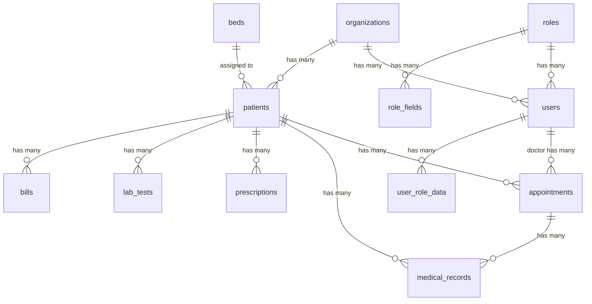

# Database Schema

## Overview

MedCare Pro uses **MySQL** as the primary database with a well-structured relational schema designed for multi-tenant hospital management. The database implements organization-based data isolation, soft deletes for audit trails, and JSON columns for flexible data storage.

## Database Configuration

```typescript
// database.ts
const dbConfig = defineConfig({
  connection: 'mysql',
  connections: {
    mysql: {
      client: 'mysql2',
      connection: {
        host: env.get('DB_HOST'),
        port: env.get('DB_PORT'), 
        user: env.get('DB_USER'),
        password: env.get('DB_PASSWORD'),
        database: env.get('DB_DATABASE'),
      },
      migrations: {
        naturalSort: true,
        paths: ['database/migrations'],
      },
    },
  },
})
```

## Core Design Principles

### 1. Multi-Tenant Architecture
- **Organization-based isolation**: All core entities link to organizations
- **Data segregation**: Queries automatically scoped by organization
- **Super admin layer**: Cross-organization management capability

### 2. Audit Trail Support
- **Soft deletes**: `deleted_at` column for data preservation
- **Timestamps**: `created_at` and `updated_at` on all tables
- **Audit logs**: Separate audit trail for critical operations

### 3. Flexible Data Storage
- **JSON columns**: Dynamic fields for extensible data
- **Master data**: Configurable dropdown values
- **Role fields**: Dynamic user profile data

## Entity Relationship Diagram



## Core Tables

### Organizations

Multi-tenant organization management.

```sql
CREATE TABLE organizations (
  id CHAR(36) PRIMARY KEY,
  name VARCHAR(255) NOT NULL,
  type ENUM('hospital', 'clinic', 'laboratory', 'pharmacy') NOT NULL,
  address TEXT,
  phone VARCHAR(20),
  email VARCHAR(191),
  website VARCHAR(255),
  registration_number VARCHAR(255),
  license_info JSON,
  subscription_plan VARCHAR(100),
  subscription_status ENUM('active', 'suspended', 'cancelled') DEFAULT 'active',
  subscription_expires_at TIMESTAMP NULL,
  settings JSON,
  is_active BOOLEAN DEFAULT true,
  created_at TIMESTAMP NOT NULL,
  updated_at TIMESTAMP NOT NULL,
  
  INDEX idx_organizations_type (type),
  INDEX idx_organizations_status (subscription_status),
  INDEX idx_organizations_active (is_active)
);
```

### Users

System users with role-based access.

```sql
CREATE TABLE users (
  id CHAR(36) PRIMARY KEY,
  email VARCHAR(191) UNIQUE NOT NULL,
  password_hash VARCHAR(255) NOT NULL,
  name VARCHAR(255) NOT NULL,
  organization_id CHAR(36),
  role_id CHAR(36),
  is_active BOOLEAN DEFAULT true,
  is_demo BOOLEAN DEFAULT false,
  email_verified_at TIMESTAMP NULL,
  last_login_at TIMESTAMP NULL,
  created_at TIMESTAMP NOT NULL,
  updated_at TIMESTAMP NOT NULL,
  deleted_at TIMESTAMP NULL,
  
  FOREIGN KEY (organization_id) REFERENCES organizations(id),
  FOREIGN KEY (role_id) REFERENCES roles(id),
  INDEX idx_users_email (email),
  INDEX idx_users_organization (organization_id),
  INDEX idx_users_role (role_id),
  INDEX idx_users_active (is_active)
);
```

### Roles

Dynamic role system with customizable permissions.

```sql
CREATE TABLE roles (
  id CHAR(36) PRIMARY KEY,
  name VARCHAR(100) NOT NULL,           -- system name (e.g., 'doctor')
  display_name VARCHAR(255) NOT NULL,   -- human readable (e.g., 'Doctor')
  description TEXT,
  permissions JSON,                     -- role permissions
  organization_id CHAR(36),             -- null for system roles
  is_system_role BOOLEAN DEFAULT false, -- protected system roles
  is_active BOOLEAN DEFAULT true,
  created_at TIMESTAMP NOT NULL,
  updated_at TIMESTAMP NOT NULL,
  
  FOREIGN KEY (organization_id) REFERENCES organizations(id),
  UNIQUE KEY unique_role_per_org (name, organization_id),
  INDEX idx_roles_organization (organization_id),
  INDEX idx_roles_system (is_system_role)
);
```

### Role Fields

Dynamic fields for extensible role data.

```sql
CREATE TABLE role_fields (
  id CHAR(36) PRIMARY KEY,
  role_id CHAR(36) NOT NULL,
  field_name VARCHAR(100) NOT NULL,     -- e.g., 'specialization'
  field_type VARCHAR(50) NOT NULL,      -- 'text', 'select', 'number', etc.
  field_label VARCHAR(255) NOT NULL,
  field_options JSON,                   -- for select/radio types
  is_required BOOLEAN DEFAULT false,
  is_system BOOLEAN DEFAULT false,      -- protected system fields
  display_order INTEGER DEFAULT 0,
  created_at TIMESTAMP NOT NULL,
  updated_at TIMESTAMP NOT NULL,
  
  FOREIGN KEY (role_id) REFERENCES roles(id) ON DELETE CASCADE,
  UNIQUE KEY unique_field_per_role (role_id, field_name),
  INDEX idx_role_fields_role (role_id)
);
```

### User Role Data

Stores dynamic role-specific user data.

```sql
CREATE TABLE user_role_data (
  id CHAR(36) PRIMARY KEY,
  user_id CHAR(36) NOT NULL,
  role_field_id CHAR(36) NOT NULL,
  field_value TEXT,
  created_at TIMESTAMP NOT NULL,
  updated_at TIMESTAMP NOT NULL,
  
  FOREIGN KEY (user_id) REFERENCES users(id) ON DELETE CASCADE,
  FOREIGN KEY (role_field_id) REFERENCES role_fields(id) ON DELETE CASCADE,
  UNIQUE KEY unique_user_field (user_id, role_field_id),
  INDEX idx_user_role_data_user (user_id)
);
```

## Patient Management Tables

### Patients

Core patient demographics and medical information.

```sql
CREATE TABLE patients (
  id CHAR(36) PRIMARY KEY,
  patient_id CHAR(36) UNIQUE NOT NULL,  -- business identifier
  name VARCHAR(255) NOT NULL,
  phone VARCHAR(20) NOT NULL,
  email VARCHAR(191),
  date_of_birth DATE NOT NULL,
  gender ENUM('male', 'female', 'other') NOT NULL,
  address TEXT NOT NULL,
  emergency_contact JSON NOT NULL,      -- {name, relationship, phone, email, address}
  blood_group ENUM('A+', 'A-', 'B+', 'B-', 'AB+', 'AB-', 'O+', 'O-'),
  allergies JSON,                       -- array of allergies
  chronic_conditions JSON,              -- array of conditions
  vaccination_records JSON,             -- vaccination history
  insurance_info JSON,                  -- insurance details
  organization_id CHAR(36) NOT NULL,    -- multi-tenant isolation
  created_at TIMESTAMP NOT NULL,
  updated_at TIMESTAMP NOT NULL,
  deleted_at TIMESTAMP NULL,            -- soft delete
  
  FOREIGN KEY (organization_id) REFERENCES organizations(id),
  INDEX idx_patients_patient_id (patient_id),
  INDEX idx_patients_phone (phone),
  INDEX idx_patients_email (email),
  INDEX idx_patients_name (name),
  INDEX idx_patients_organization (organization_id),
  INDEX idx_patients_deleted (deleted_at)
);
```

### Appointments

Appointment scheduling and management.

```sql
CREATE TABLE appointments (
  id CHAR(36) PRIMARY KEY,
  appointment_id CHAR(36) UNIQUE NOT NULL,
  patient_id CHAR(36) NOT NULL,
  doctor_id CHAR(36) NOT NULL,          -- references users table
  appointment_date TIMESTAMP NOT NULL,
  appointment_time TIMESTAMP NOT NULL,
  duration INTEGER NOT NULL,            -- minutes
  status ENUM('scheduled', 'confirmed', 'checked_in', 'in_progress', 'completed', 'cancelled', 'no_show') DEFAULT 'scheduled',
  type VARCHAR(100) NOT NULL,           -- consultation, follow_up, emergency
  priority ENUM('low', 'normal', 'high', 'urgent') DEFAULT 'normal',
  reason TEXT NOT NULL,
  notes TEXT,
  symptoms JSON,                        -- array of symptoms
  vitals JSON,                          -- vital signs data
  checked_in_at TIMESTAMP NULL,
  checked_out_at TIMESTAMP NULL,
  room_number VARCHAR(50),
  organization_id CHAR(36) NOT NULL,
  created_at TIMESTAMP NOT NULL,
  updated_at TIMESTAMP NOT NULL,
  
  FOREIGN KEY (patient_id) REFERENCES patients(id),
  FOREIGN KEY (doctor_id) REFERENCES users(id),
  FOREIGN KEY (organization_id) REFERENCES organizations(id),
  INDEX idx_appointments_patient (patient_id),
  INDEX idx_appointments_doctor (doctor_id),
  INDEX idx_appointments_date (appointment_date),
  INDEX idx_appointments_status (status),
  INDEX idx_appointments_organization (organization_id)
);
```

### Medical Records

Clinical documentation and medical history.

```sql
CREATE TABLE medical_records (
  id CHAR(36) PRIMARY KEY,
  record_id CHAR(36) UNIQUE NOT NULL,
  patient_id CHAR(36) NOT NULL,
  doctor_id CHAR(36) NOT NULL,
  appointment_id CHAR(36),
  visit_date TIMESTAMP NOT NULL,
  chief_complaint TEXT,
  history_of_present_illness TEXT,
  past_medical_history JSON,
  family_history JSON,
  social_history JSON,
  allergies JSON,
  medications JSON,
  physical_examination JSON,
  vital_signs JSON,                     -- {temperature, bp, heart_rate, etc.}
  assessment TEXT,
  diagnosis JSON,                       -- array of diagnoses
  treatment_plan TEXT,
  procedures_performed JSON,
  lab_results JSON,
  imaging_results JSON,
  follow_up_instructions TEXT,
  notes TEXT,
  is_confidential BOOLEAN DEFAULT false,
  organization_id CHAR(36) NOT NULL,
  created_at TIMESTAMP NOT NULL,
  updated_at TIMESTAMP NOT NULL,
  
  FOREIGN KEY (patient_id) REFERENCES patients(id),
  FOREIGN KEY (doctor_id) REFERENCES users(id),
  FOREIGN KEY (appointment_id) REFERENCES appointments(id),
  FOREIGN KEY (organization_id) REFERENCES organizations(id),
  INDEX idx_medical_records_patient (patient_id),
  INDEX idx_medical_records_doctor (doctor_id),
  INDEX idx_medical_records_appointment (appointment_id),
  INDEX idx_medical_records_visit_date (visit_date),
  INDEX idx_medical_records_organization (organization_id)
);
```

## Clinical Management Tables

### Prescriptions

Medication prescriptions and management.

```sql
CREATE TABLE prescriptions (
  id CHAR(36) PRIMARY KEY,
  prescription_id CHAR(36) UNIQUE NOT NULL,
  patient_id CHAR(36) NOT NULL,
  doctor_id CHAR(36) NOT NULL,
  appointment_id CHAR(36),
  medical_record_id CHAR(36),
  medications JSON NOT NULL,            -- array of medication objects
  instructions TEXT,
  valid_until DATE,
  status ENUM('active', 'dispensed', 'expired', 'cancelled') DEFAULT 'active',
  dispensed_at TIMESTAMP NULL,
  dispensed_by CHAR(36),               -- user who dispensed
  pharmacy_notes TEXT,
  organization_id CHAR(36) NOT NULL,
  created_at TIMESTAMP NOT NULL,
  updated_at TIMESTAMP NOT NULL,
  
  FOREIGN KEY (patient_id) REFERENCES patients(id),
  FOREIGN KEY (doctor_id) REFERENCES users(id),
  FOREIGN KEY (appointment_id) REFERENCES appointments(id),
  FOREIGN KEY (medical_record_id) REFERENCES medical_records(id),
  FOREIGN KEY (dispensed_by) REFERENCES users(id),
  FOREIGN KEY (organization_id) REFERENCES organizations(id),
  INDEX idx_prescriptions_patient (patient_id),
  INDEX idx_prescriptions_doctor (doctor_id),
  INDEX idx_prescriptions_status (status),
  INDEX idx_prescriptions_organization (organization_id)
);
```

### Lab Tests

Laboratory test orders and results.

```sql
CREATE TABLE lab_tests (
  id CHAR(36) PRIMARY KEY,
  test_id CHAR(36) UNIQUE NOT NULL,
  patient_id CHAR(36) NOT NULL,
  doctor_id CHAR(36) NOT NULL,
  appointment_id CHAR(36),
  test_name VARCHAR(255) NOT NULL,
  test_category VARCHAR(100),
  test_code VARCHAR(50),
  specimen_type VARCHAR(100),
  collection_date TIMESTAMP,
  report_date TIMESTAMP,
  status ENUM('ordered', 'collected', 'in_progress', 'completed', 'cancelled') DEFAULT 'ordered',
  priority ENUM('routine', 'urgent', 'stat') DEFAULT 'routine',
  results JSON,                         -- test results data
  reference_ranges JSON,                -- normal value ranges
  interpretation TEXT,
  notes TEXT,
  technician_id CHAR(36),              -- lab technician
  verified_by CHAR(36),                -- verifying doctor/supervisor
  organization_id CHAR(36) NOT NULL,
  created_at TIMESTAMP NOT NULL,
  updated_at TIMESTAMP NOT NULL,
  
  FOREIGN KEY (patient_id) REFERENCES patients(id),
  FOREIGN KEY (doctor_id) REFERENCES users(id),
  FOREIGN KEY (appointment_id) REFERENCES appointments(id),
  FOREIGN KEY (technician_id) REFERENCES users(id),
  FOREIGN KEY (verified_by) REFERENCES users(id),
  FOREIGN KEY (organization_id) REFERENCES organizations(id),
  INDEX idx_lab_tests_patient (patient_id),
  INDEX idx_lab_tests_doctor (doctor_id),
  INDEX idx_lab_tests_status (status),
  INDEX idx_lab_tests_collection_date (collection_date),
  INDEX idx_lab_tests_organization (organization_id)
);
```

## Financial Management Tables

### Bills

Billing and invoicing management.

```sql
CREATE TABLE bills (
  id CHAR(36) PRIMARY KEY,
  bill_id CHAR(36) UNIQUE NOT NULL,
  patient_id CHAR(36) NOT NULL,
  appointment_id CHAR(36),
  bill_date DATE NOT NULL,
  due_date DATE,
  items JSON NOT NULL,                  -- array of billing items
  subtotal DECIMAL(10,2) NOT NULL,
  tax_amount DECIMAL(10,2) DEFAULT 0,
  discount_amount DECIMAL(10,2) DEFAULT 0,
  total_amount DECIMAL(10,2) NOT NULL,
  paid_amount DECIMAL(10,2) DEFAULT 0,
  balance_amount DECIMAL(10,2) NOT NULL,
  status ENUM('draft', 'sent', 'paid', 'overdue', 'cancelled') DEFAULT 'draft',
  payment_method VARCHAR(50),
  payment_reference VARCHAR(255),
  payment_date TIMESTAMP NULL,
  notes TEXT,
  organization_id CHAR(36) NOT NULL,
  created_at TIMESTAMP NOT NULL,
  updated_at TIMESTAMP NOT NULL,
  
  FOREIGN KEY (patient_id) REFERENCES patients(id),
  FOREIGN KEY (appointment_id) REFERENCES appointments(id),
  FOREIGN KEY (organization_id) REFERENCES organizations(id),
  INDEX idx_bills_patient (patient_id),
  INDEX idx_bills_bill_date (bill_date),
  INDEX idx_bills_due_date (due_date),
  INDEX idx_bills_status (status),
  INDEX idx_bills_organization (organization_id)
);
```

## Facility Management Tables

### Beds

Hospital bed and room management.

```sql
CREATE TABLE beds (
  id CHAR(36) PRIMARY KEY,
  bed_number VARCHAR(50) NOT NULL,
  room_number VARCHAR(50) NOT NULL,
  ward VARCHAR(100),
  bed_type ENUM('general', 'private', 'icu', 'emergency', 'maternity') NOT NULL,
  status ENUM('available', 'occupied', 'maintenance', 'out_of_service') DEFAULT 'available',
  patient_id CHAR(36),                  -- currently assigned patient
  assigned_at TIMESTAMP NULL,
  discharge_expected_at TIMESTAMP NULL,
  daily_rate DECIMAL(8,2),
  amenities JSON,                       -- array of amenities
  notes TEXT,
  organization_id CHAR(36) NOT NULL,
  created_at TIMESTAMP NOT NULL,
  updated_at TIMESTAMP NOT NULL,
  
  FOREIGN KEY (patient_id) REFERENCES patients(id),
  FOREIGN KEY (organization_id) REFERENCES organizations(id),
  UNIQUE KEY unique_bed_per_org (bed_number, organization_id),
  INDEX idx_beds_status (status),
  INDEX idx_beds_room (room_number),
  INDEX idx_beds_patient (patient_id),
  INDEX idx_beds_organization (organization_id)
);
```

### Inventory

Medical supply and equipment inventory.

```sql
CREATE TABLE inventories (
  id CHAR(36) PRIMARY KEY,
  item_code VARCHAR(100) NOT NULL,
  item_name VARCHAR(255) NOT NULL,
  category VARCHAR(100),
  subcategory VARCHAR(100),
  description TEXT,
  unit_of_measure VARCHAR(50),
  current_stock INTEGER NOT NULL DEFAULT 0,
  minimum_stock INTEGER DEFAULT 0,
  maximum_stock INTEGER,
  reorder_level INTEGER,
  unit_cost DECIMAL(10,2),
  supplier_info JSON,
  expiry_date DATE,
  batch_number VARCHAR(100),
  location VARCHAR(255),
  barcode VARCHAR(255),
  is_active BOOLEAN DEFAULT true,
  organization_id CHAR(36) NOT NULL,
  created_at TIMESTAMP NOT NULL,
  updated_at TIMESTAMP NOT NULL,
  
  FOREIGN KEY (organization_id) REFERENCES organizations(id),
  UNIQUE KEY unique_item_code_per_org (item_code, organization_id),
  INDEX idx_inventories_category (category),
  INDEX idx_inventories_stock_level (current_stock),
  INDEX idx_inventories_expiry (expiry_date),
  INDEX idx_inventories_organization (organization_id)
);
```

## Support Tables

### Master Data

Configurable dropdown and reference data.

```sql
CREATE TABLE master_data (
  id CHAR(36) PRIMARY KEY,
  category VARCHAR(100) NOT NULL,       -- e.g., 'specializations', 'departments'
  code VARCHAR(100) NOT NULL,           -- unique code within category
  name VARCHAR(255) NOT NULL,           -- display name
  description TEXT,
  sort_order INTEGER DEFAULT 0,
  is_active BOOLEAN DEFAULT true,
  metadata JSON,                        -- additional data
  organization_id CHAR(36),             -- null for global data
  created_at TIMESTAMP NOT NULL,
  updated_at TIMESTAMP NOT NULL,
  
  FOREIGN KEY (organization_id) REFERENCES organizations(id),
  UNIQUE KEY unique_code_per_category_org (category, code, organization_id),
  INDEX idx_master_data_category (category),
  INDEX idx_master_data_active (is_active),
  INDEX idx_master_data_organization (organization_id)
);
```

### Notifications

System notifications and alerts.

```sql
CREATE TABLE notifications (
  id CHAR(36) PRIMARY KEY,
  user_id CHAR(36) NOT NULL,
  title VARCHAR(255) NOT NULL,
  message TEXT NOT NULL,
  type ENUM('info', 'success', 'warning', 'error') DEFAULT 'info',
  category VARCHAR(100),
  data JSON,                            -- additional notification data
  is_read BOOLEAN DEFAULT false,
  read_at TIMESTAMP NULL,
  expires_at TIMESTAMP NULL,
  organization_id CHAR(36) NOT NULL,
  created_at TIMESTAMP NOT NULL,
  updated_at TIMESTAMP NOT NULL,
  
  FOREIGN KEY (user_id) REFERENCES users(id),
  FOREIGN KEY (organization_id) REFERENCES organizations(id),
  INDEX idx_notifications_user (user_id),
  INDEX idx_notifications_read (is_read),
  INDEX idx_notifications_type (type),
  INDEX idx_notifications_organization (organization_id)
);
```

### Doctor Schedules

Doctor working schedules and availability.

```sql
CREATE TABLE doctor_schedules (
  id CHAR(36) PRIMARY KEY,
  doctor_id CHAR(36) NOT NULL,          -- references users table
  day_of_week ENUM('monday', 'tuesday', 'wednesday', 'thursday', 'friday', 'saturday', 'sunday') NOT NULL,
  start_time TIME NOT NULL,
  end_time TIME NOT NULL,
  slot_duration INTEGER DEFAULT 30,     -- minutes per appointment slot
  is_available BOOLEAN DEFAULT true,
  organization_id CHAR(36) NOT NULL,
  created_at TIMESTAMP NOT NULL,
  updated_at TIMESTAMP NOT NULL,
  
  FOREIGN KEY (doctor_id) REFERENCES users(id),
  FOREIGN KEY (organization_id) REFERENCES organizations(id),
  UNIQUE KEY unique_doctor_day (doctor_id, day_of_week),
  INDEX idx_doctor_schedules_doctor (doctor_id),
  INDEX idx_doctor_schedules_organization (organization_id)
);
```

### Doctor Availability

Specific date availability overrides.

```sql
CREATE TABLE doctor_availability (
  id CHAR(36) PRIMARY KEY,
  doctor_id CHAR(36) NOT NULL,
  availability_date DATE NOT NULL,
  start_time TIME,
  end_time TIME,
  is_available BOOLEAN NOT NULL,
  reason VARCHAR(255),                  -- reason for unavailability
  slot_duration INTEGER DEFAULT 30,
  organization_id CHAR(36) NOT NULL,
  created_at TIMESTAMP NOT NULL,
  updated_at TIMESTAMP NOT NULL,
  
  FOREIGN KEY (doctor_id) REFERENCES users(id),
  FOREIGN KEY (organization_id) REFERENCES organizations(id),
  UNIQUE KEY unique_doctor_date (doctor_id, availability_date),
  INDEX idx_doctor_availability_doctor (doctor_id),
  INDEX idx_doctor_availability_date (availability_date),
  INDEX idx_doctor_availability_organization (organization_id)
);
```

## System Management Tables

### System Settings

Application-wide configuration settings.

```sql
CREATE TABLE system_settings (
  id CHAR(36) PRIMARY KEY,
  key_name VARCHAR(100) UNIQUE NOT NULL,
  key_value TEXT,
  data_type ENUM('string', 'number', 'boolean', 'json') DEFAULT 'string',
  category VARCHAR(100),
  description TEXT,
  is_public BOOLEAN DEFAULT false,      -- accessible to frontend
  organization_id CHAR(36),             -- null for global settings
  created_at TIMESTAMP NOT NULL,
  updated_at TIMESTAMP NOT NULL,
  
  FOREIGN KEY (organization_id) REFERENCES organizations(id),
  INDEX idx_system_settings_category (category),
  INDEX idx_system_settings_public (is_public),
  INDEX idx_system_settings_organization (organization_id)
);
```

### Audit Logs

System audit trail for security and compliance.

```sql
CREATE TABLE audit_logs (
  id CHAR(36) PRIMARY KEY,
  user_id CHAR(36),
  action VARCHAR(100) NOT NULL,         -- create, update, delete, login, etc.
  resource VARCHAR(100) NOT NULL,       -- table or resource name
  resource_id CHAR(36),                 -- affected record ID
  old_values JSON,                      -- before values
  new_values JSON,                      -- after values
  ip_address VARCHAR(45),
  user_agent TEXT,
  organization_id CHAR(36),
  created_at TIMESTAMP NOT NULL,
  
  FOREIGN KEY (user_id) REFERENCES users(id),
  FOREIGN KEY (organization_id) REFERENCES organizations(id),
  INDEX idx_audit_logs_user (user_id),
  INDEX idx_audit_logs_action (action),
  INDEX idx_audit_logs_resource (resource),
  INDEX idx_audit_logs_created_at (created_at),
  INDEX idx_audit_logs_organization (organization_id)
);
```

### Super Admin Tables

#### Super Dupar Admins

Super admin user management.

```sql
CREATE TABLE super_dupar_admins (
  id CHAR(36) PRIMARY KEY,
  email VARCHAR(191) UNIQUE NOT NULL,
  password_hash VARCHAR(255) NOT NULL,
  name VARCHAR(255) NOT NULL,
  permissions JSON,                     -- super admin permissions
  is_active BOOLEAN DEFAULT true,
  last_login_at TIMESTAMP NULL,
  created_at TIMESTAMP NOT NULL,
  updated_at TIMESTAMP NOT NULL,
  
  INDEX idx_super_admins_email (email),
  INDEX idx_super_admins_active (is_active)
);
```

#### Super Admin Activities

Super admin activity logging.

```sql
CREATE TABLE super_dupar_admin_activities (
  id CHAR(36) PRIMARY KEY,
  super_admin_id CHAR(36) NOT NULL,
  action VARCHAR(100) NOT NULL,
  target_type VARCHAR(100),             -- organization, user, etc.
  target_id CHAR(36),
  description TEXT,
  ip_address VARCHAR(45),
  user_agent TEXT,
  created_at TIMESTAMP NOT NULL,
  
  FOREIGN KEY (super_admin_id) REFERENCES super_dupar_admins(id),
  INDEX idx_super_admin_activities_admin (super_admin_id),
  INDEX idx_super_admin_activities_action (action),
  INDEX idx_super_admin_activities_created_at (created_at)
);
```

## Indexes and Performance

### Primary Indexes
- All tables have UUID primary keys
- Foreign key relationships are indexed
- Organization-based queries are optimized

### Search Indexes
- Patient names, phones, emails
- Appointment dates and statuses
- Medical record dates
- Bill due dates and statuses

### Composite Indexes
- (organization_id, created_at) for timeline queries
- (patient_id, appointment_date) for patient schedules
- (doctor_id, availability_date) for doctor availability

## Data Types and Constraints

### UUID Strategy
All primary keys use UUID (CHAR(36)) for:
- **Global uniqueness**: Safe for distributed systems
- **Security**: Non-sequential IDs prevent enumeration
- **Scalability**: No auto-increment bottlenecks

### JSON Column Usage
JSON columns store flexible data:
- **Emergency contacts**: Contact information
- **Vital signs**: Medical measurements
- **Medications**: Prescription details
- **Settings**: Configuration data

### Enum Constraints
Enums ensure data integrity:
- **Gender**: male, female, other
- **Blood groups**: A+, A-, B+, B-, AB+, AB-, O+, O-
- **Appointment status**: scheduled, confirmed, completed, etc.
- **User status**: active, inactive, suspended

## Migration Strategy

### Version Control
- **Sequential migrations**: Numbered by timestamp
- **Forward compatibility**: Additive changes preferred
- **Rollback support**: Down methods for reversibility

### Data Seeding
- **System roles**: Default role templates
- **Master data**: Common medical data
- **Demo data**: Sample organizations and users

This database schema provides a robust foundation for hospital management with proper normalization, audit trails, and multi-tenant support while maintaining flexibility for customization and growth.
