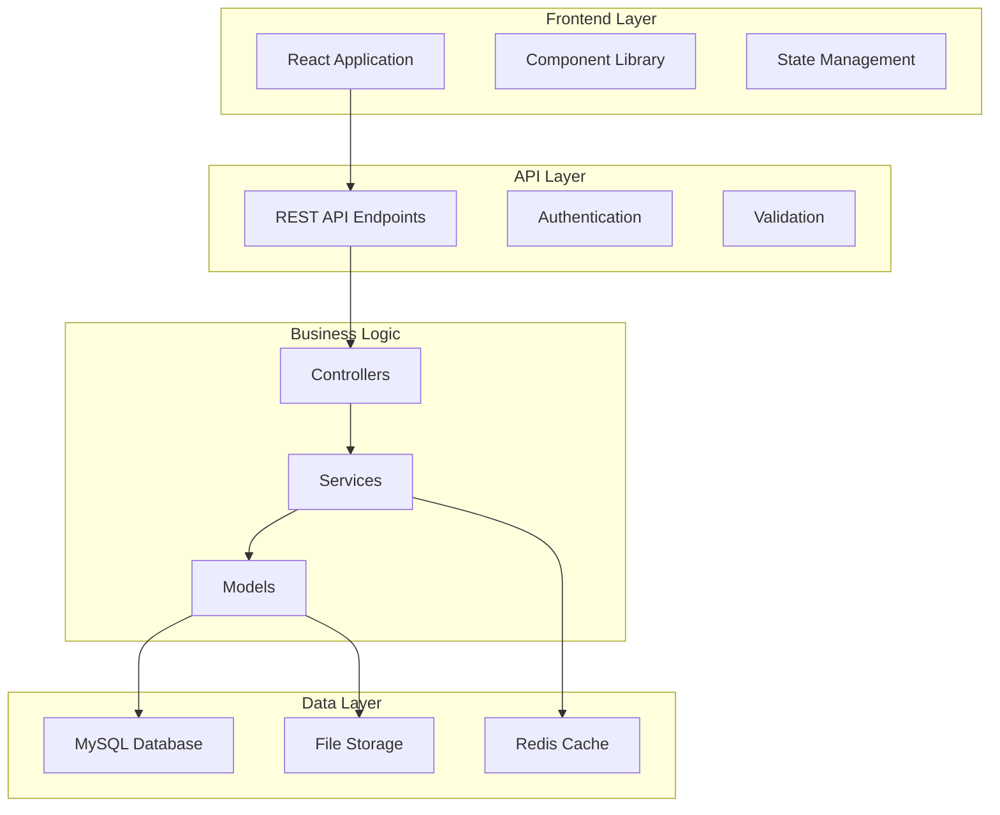
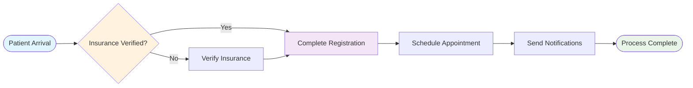
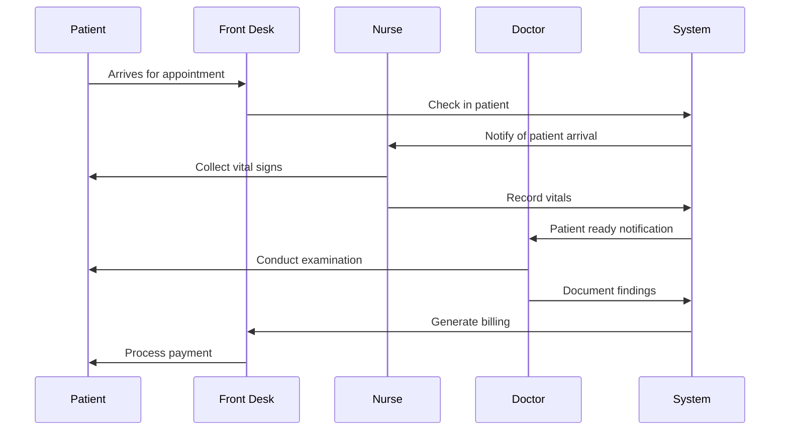

# Visual Documentation Enhancement

## Overview

This document outlines strategies for enhancing MedCare Pro documentation with visual elements that improve comprehension, reduce learning time, and create a more engaging user experience. Visual documentation includes diagrams, screenshots, infographics, interactive elements, and multimedia content.

## Visual Design Principles

### 1. Brand Consistency

**Color Palette:**
```css
/* Primary Colors */
:root {
  --primary-blue: #2563eb;      /* Primary brand color */
  --primary-green: #10b981;     /* Success/confirmation */
  --primary-red: #ef4444;       /* Errors/warnings */
  --primary-amber: #f59e0b;     /* Warnings/attention */
  
  /* Neutral Colors */
  --gray-50: #f9fafb;
  --gray-100: #f3f4f6;
  --gray-200: #e5e7eb;
  --gray-500: #6b7280;
  --gray-900: #111827;
  
  /* Background Colors */
  --bg-primary: #ffffff;
  --bg-secondary: #f8fafc;
  --bg-accent: #eff6ff;
}
```

**Typography Hierarchy:**
```css
/* Documentation Typography */
.docs-heading-1 {
  font-family: 'Inter', sans-serif;
  font-size: 2.5rem;
  font-weight: 700;
  color: var(--gray-900);
  line-height: 1.2;
}

.docs-heading-2 {
  font-family: 'Inter', sans-serif;
  font-size: 2rem;
  font-weight: 600;
  color: var(--gray-900);
  line-height: 1.3;
}

.docs-body {
  font-family: 'Inter', sans-serif;
  font-size: 1rem;
  font-weight: 400;
  color: var(--gray-700);
  line-height: 1.6;
}

.docs-code {
  font-family: 'JetBrains Mono', 'Courier New', monospace;
  font-size: 0.875rem;
  background: var(--bg-accent);
  padding: 0.25rem 0.5rem;
  border-radius: 0.25rem;
}
```

### 2. Visual Hierarchy Standards

**Information Architecture:**
```
Level 1: Page Title
├── Visual: Large heading with icon
├── Purpose: Establish context and main topic
└── Style: H1, primary color, 40px font size

Level 2: Major Sections
├── Visual: Colored section headers with icons
├── Purpose: Organize content into digestible chunks
└── Style: H2, secondary color, 32px font size

Level 3: Subsections
├── Visual: Clear subsection breaks
├── Purpose: Detail specific features or processes
└── Style: H3, tertiary color, 24px font size

Level 4: Process Steps
├── Visual: Numbered or bulleted lists
├── Purpose: Sequential instructions or information
└── Style: H4, standard text color, 18px font size
```

## Screenshot Standards and Guidelines

### 1. Screenshot Capture Requirements

**Technical Specifications:**
```yaml
Resolution: 1920x1080 (minimum)
Format: PNG for UI screenshots, JPG for photos
Quality: Lossless compression for UI elements
Browser: Chrome (latest stable version)
Zoom Level: 100% (no browser zoom)
Window Size: Standardized viewport (1400x900)
```

**UI State Requirements:**
```yaml
Clean Interface:
  - Remove personal information
  - Use consistent sample data
  - Clear browser cache and extensions
  - Ensure consistent theme/settings

Highlighting:
  - Use red outline boxes for important elements
  - Add numbered callouts for step sequences
  - Include cursor pointer for clickable elements
  - Highlight form fields being discussed
```

**Screenshot Annotation System:**
```css
/* Annotation Styles */
.screenshot-annotation {
  position: relative;
  display: inline-block;
}

.annotation-number {
  position: absolute;
  background: var(--primary-red);
  color: white;
  border-radius: 50%;
  width: 24px;
  height: 24px;
  display: flex;
  align-items: center;
  justify-content: center;
  font-weight: bold;
  font-size: 14px;
  z-index: 10;
}

.annotation-highlight {
  position: absolute;
  border: 2px solid var(--primary-red);
  border-radius: 4px;
  background: rgba(239, 68, 68, 0.1);
  pointer-events: none;
}

.annotation-arrow {
  position: absolute;
  width: 0;
  height: 0;
  border-left: 10px solid transparent;
  border-right: 10px solid transparent;
  border-top: 15px solid var(--primary-red);
}
```

### 2. Screenshot Organization System

**File Naming Convention:**
```
Format: [module]-[feature]-[step]-[version].png

Examples:
- patient-registration-step1-v2.png
- appointment-calendar-overview-v3.png
- billing-invoice-creation-step4-v1.png
- dashboard-overview-admin-v2.png

Directory Structure:
docs/images/
├── screenshots/
│   ├── patient-management/
│   ├── appointments/
│   ├── medical-records/
│   ├── billing/
│   ├── administration/
│   └── dashboard/
├── diagrams/
├── infographics/
└── icons/
```

**Image Processing Workflow:**
```typescript
interface ScreenshotMetadata {
  filename: string;
  module: string;
  feature: string;
  step?: number;
  version: number;
  captureDate: Date;
  resolution: string;
  annotations: Annotation[];
  altText: string;
  description: string;
}

class ScreenshotManager {
  public processScreenshot(file: File, metadata: ScreenshotMetadata): ProcessedImage {
    // Optimize image size
    const optimized = this.optimizeImage(file);
    
    // Add annotations
    const annotated = this.addAnnotations(optimized, metadata.annotations);
    
    // Generate responsive versions
    const responsive = this.generateResponsiveVersions(annotated);
    
    return {
      original: annotated,
      responsive,
      metadata,
      webOptimized: this.convertToWebP(annotated)
    };
  }
  
  private optimizeImage(file: File): OptimizedImage {
    return {
      compressed: this.compressImage(file, 0.9),
      resized: this.resizeForWeb(file, { maxWidth: 1200, maxHeight: 800 }),
      cropped: this.cropToContent(file)
    };
  }
}
```

## Diagram Creation Standards

### 1. System Architecture Diagrams

**Architectural Diagram Template:**


**Workflow Diagram Standards:**


### 2. Process Flow Diagrams

**Patient Journey Mapping:**
```yaml
Patient Registration Process:
  1. Arrival & Check-in:
     - Visual: Patient icon entering building
     - Process: Identity verification, insurance check
     - System: Patient search, new record creation
     
  2. Information Collection:
     - Visual: Form completion illustration
     - Process: Demographics, medical history, contacts
     - System: Data validation, duplicate detection
     
  3. Documentation:
     - Visual: Document scanning icons
     - Process: ID scan, insurance card, medical records
     - System: File upload, OCR processing
     
  4. Confirmation:
     - Visual: Checkmark with patient photo
     - Process: Review information, patient confirmation
     - System: Record finalization, notification trigger
```

**Clinical Workflow Visualization:**


### 3. Interactive Diagram Components

**Clickable Interface Maps:**
```html
<!-- Interactive UI Component Map -->
<div class="interactive-diagram">
  
  
  <map name="dashboard-map">
    <area shape="rect" coords="10,10,200,60" 
          href="#navigation-menu" 
          alt="Navigation Menu"
          title="Click to learn about navigation">
    
    <area shape="rect" coords="220,10,600,200" 
          href="#patient-summary" 
          alt="Patient Summary Widget"
          title="Patient information display">
    
    <area shape="rect" coords="620,10,1000,200" 
          href="#appointment-calendar" 
          alt="Appointment Calendar"
          title="Schedule management">
  </map>
</div>

<style>
.interactive-diagram area:hover {
  opacity: 0.8;
  cursor: pointer;
}

.interactive-diagram area:focus {
  outline: 2px solid var(--primary-blue);
}
</style>
```

## Infographic Design Standards

### 1. Statistical Presentations

**Performance Metrics Infographic:**
```css
.metrics-infographic {
  display: grid;
  grid-template-columns: repeat(auto-fit, minmax(250px, 1fr));
  gap: 2rem;
  padding: 2rem;
  background: linear-gradient(135deg, #667eea 0%, #764ba2 100%);
  border-radius: 1rem;
  color: white;
}

.metric-card {
  background: rgba(255, 255, 255, 0.1);
  padding: 1.5rem;
  border-radius: 0.75rem;
  text-align: center;
  backdrop-filter: blur(10px);
}

.metric-number {
  font-size: 3rem;
  font-weight: 700;
  margin-bottom: 0.5rem;
  color: #fbbf24;
}

.metric-label {
  font-size: 1.1rem;
  font-weight: 500;
  opacity: 0.9;
}

.metric-description {
  font-size: 0.9rem;
  margin-top: 0.5rem;
  opacity: 0.7;
}
```

**Feature Comparison Charts:**
```html
<!-- Before/After Comparison -->
<div class="comparison-infographic">
  <div class="comparison-section before">
    <h3>Before MedCare Pro</h3>
    <div class="pain-points">
      <div class="pain-point">
        <icon>⏰</icon>
        <span>45 minutes average patient processing</span>
      </div>
      <div class="pain-point">
        <icon>📄</icon>
        <span>Paper-based record keeping</span>
      </div>
      <div class="pain-point">
        <icon>❌</icon>
        <span>15% appointment no-shows</span>
      </div>
    </div>
  </div>
  
  <div class="comparison-arrow">
    <icon>→</icon>
    <span>Transform with MedCare Pro</span>
  </div>
  
  <div class="comparison-section after">
    <h3>After MedCare Pro</h3>
    <div class="benefits">
      <div class="benefit">
        <icon>⚡</icon>
        <span>15 minutes average processing</span>
      </div>
      <div class="benefit">
        <icon>💻</icon>
        <span>100% digital records</span>
      </div>
      <div class="benefit">
        <icon>✅</icon>
        <span>5% appointment no-shows</span>
      </div>
    </div>
  </div>
</div>
```

### 2. Process Visualization

**Step-by-Step Process Graphics:**
```css
.process-timeline {
  position: relative;
  padding: 2rem 0;
}

.process-timeline::before {
  content: '';
  position: absolute;
  left: 50%;
  top: 0;
  bottom: 0;
  width: 4px;
  background: var(--primary-blue);
  transform: translateX(-50%);
}

.process-step {
  position: relative;
  margin: 2rem 0;
  display: flex;
  align-items: center;
}

.process-step:nth-child(odd) {
  flex-direction: row;
}

.process-step:nth-child(even) {
  flex-direction: row-reverse;
}

.step-content {
  background: white;
  padding: 1.5rem;
  border-radius: 1rem;
  box-shadow: 0 4px 6px rgba(0, 0, 0, 0.1);
  width: 45%;
  margin: 0 2rem;
}

.step-number {
  position: absolute;
  left: 50%;
  top: 50%;
  transform: translate(-50%, -50%);
  background: var(--primary-blue);
  color: white;
  width: 40px;
  height: 40px;
  border-radius: 50%;
  display: flex;
  align-items: center;
  justify-content: center;
  font-weight: bold;
  z-index: 2;
}
```

## Interactive Visual Elements

### 1. Animated Demonstrations

**CSS Animation Library:**
```css
/* Fade-in animations for content reveal */
@keyframes fadeInUp {
  from {
    opacity: 0;
    transform: translateY(30px);
  }
  to {
    opacity: 1;
    transform: translateY(0);
  }
}

.fade-in-up {
  animation: fadeInUp 0.6s ease-out;
}

/* Highlighting animations for UI elements */
@keyframes highlight {
  0% {
    box-shadow: 0 0 0 0 rgba(37, 99, 235, 0.7);
  }
  70% {
    box-shadow: 0 0 0 10px rgba(37, 99, 235, 0);
  }
  100% {
    box-shadow: 0 0 0 0 rgba(37, 99, 235, 0);
  }
}

.highlight-element {
  animation: highlight 2s infinite;
}

/* Progress indicators */
@keyframes progress {
  from {
    transform: translateX(-100%);
  }
  to {
    transform: translateX(0);
  }
}

.progress-bar {
  position: relative;
  background: #e5e7eb;
  height: 8px;
  border-radius: 4px;
  overflow: hidden;
}

.progress-fill {
  background: var(--primary-blue);
  height: 100%;
  animation: progress 2s ease-in-out;
}
```

### 2. Interactive Code Examples

**Syntax Highlighted Code Blocks:**
```typescript
// Interactive code example with copy functionality
class CodeBlockManager {
  public createInteractiveBlock(code: string, language: string): HTMLElement {
    const container = document.createElement('div');
    container.className = 'code-block-container';
    
    // Syntax highlighting
    const highlighted = this.highlightSyntax(code, language);
    
    // Copy button
    const copyButton = this.createCopyButton(code);
    
    // Line numbers
    const lineNumbers = this.generateLineNumbers(code);
    
    container.appendChild(lineNumbers);
    container.appendChild(highlighted);
    container.appendChild(copyButton);
    
    return container;
  }
  
  private createCopyButton(code: string): HTMLElement {
    const button = document.createElement('button');
    button.textContent = 'Copy';
    button.className = 'copy-button';
    
    button.addEventListener('click', () => {
      navigator.clipboard.writeText(code);
      this.showCopyFeedback(button);
    });
    
    return button;
  }
  
  private showCopyFeedback(button: HTMLElement) {
    const originalText = button.textContent;
    button.textContent = 'Copied!';
    button.classList.add('copied');
    
    setTimeout(() => {
      button.textContent = originalText;
      button.classList.remove('copied');
    }, 2000);
  }
}
```

### 3. Progressive Disclosure Elements

**Expandable Sections:**
```html
<!-- Collapsible content sections -->
<div class="expandable-section">
  <button class="section-toggle" aria-expanded="false">
    <span class="toggle-icon">▶</span>
    <span class="section-title">Advanced Configuration Options</span>
  </button>
  
  <div class="section-content" hidden>
    <p>Detailed configuration information that's hidden by default...</p>
    <pre><code>
      // Advanced configuration code
      const config = {
        advanced: true,
        options: []
      };
    </code></pre>
  </div>
</div>

<style>
.section-toggle {
  width: 100%;
  text-align: left;
  background: none;
  border: none;
  padding: 1rem;
  cursor: pointer;
  display: flex;
  align-items: center;
  gap: 0.5rem;
  transition: background-color 0.2s;
}

.section-toggle:hover {
  background: var(--bg-secondary);
}

.toggle-icon {
  transition: transform 0.2s;
}

.section-toggle[aria-expanded="true"] .toggle-icon {
  transform: rotate(90deg);
}

.section-content {
  padding: 0 1rem 1rem;
  animation: fadeInUp 0.3s ease-out;
}
</style>
```

## Accessibility in Visual Documentation

### 1. Alt Text Standards

**Descriptive Alt Text Guidelines:**
```typescript
interface AltTextStandards {
  screenshots: {
    pattern: "Screenshot of [module] showing [specific feature] with [key elements visible]";
    example: "Screenshot of patient registration form showing personal information fields with validation messages";
  };
  
  diagrams: {
    pattern: "Diagram illustrating [process/concept] with [key components] and [relationships]";
    example: "Flowchart illustrating patient check-in process with decision points for insurance verification";
  };
  
  infographics: {
    pattern: "Infographic displaying [data/information] comparing [elements] with [key insights]";
    example: "Infographic displaying performance metrics comparing before and after MedCare Pro implementation";
  };
}

class AccessibilityManager {
  public generateAltText(imageType: string, content: ImageContent): string {
    const templates = this.getAltTextTemplates();
    const template = templates[imageType];
    
    return this.populateTemplate(template, content);
  }
  
  public validateAltText(altText: string): ValidationResult {
    return {
      isDescriptive: altText.length > 10,
      avoidsRedundancy: !altText.toLowerCase().includes('image of'),
      includesContext: this.hasContextualInformation(altText),
      isAccessible: this.meetsAccessibilityStandards(altText)
    };
  }
}
```

### 2. Color Accessibility

**Color Contrast Standards:**
```css
/* WCAG AA Compliant Color Combinations */
:root {
  /* High contrast combinations for text */
  --text-primary: #111827;     /* Contrast ratio: 16.7:1 on white */
  --text-secondary: #374151;   /* Contrast ratio: 12.6:1 on white */
  --text-tertiary: #6b7280;    /* Contrast ratio: 7.1:1 on white */
  
  /* Accessible color combinations for UI elements */
  --success-bg: #d1fae5;
  --success-text: #065f46;     /* Contrast ratio: 10.1:1 */
  
  --warning-bg: #fef3c7;
  --warning-text: #92400e;     /* Contrast ratio: 8.2:1 */
  
  --error-bg: #fee2e2;
  --error-text: #991b1b;       /* Contrast ratio: 9.3:1 */
}

/* Color-blind friendly patterns */
.status-indicator {
  position: relative;
}

.status-indicator::before {
  content: '';
  position: absolute;
  width: 8px;
  height: 8px;
  border-radius: 50%;
  left: -16px;
  top: 50%;
  transform: translateY(-50%);
}

.status-success::before {
  background: var(--success-text);
}

.status-warning::before {
  background: var(--warning-text);
  border: 2px solid currentColor;
  background: transparent;
}

.status-error::before {
  background: var(--error-text);
  clip-path: polygon(50% 0%, 0% 100%, 100% 100%);
  border-radius: 0;
}
```

## Content Management and Version Control

### 1. Visual Asset Management

**Asset Organization System:**
```yaml
Directory Structure:
docs/
├── assets/
│   ├── images/
│   │   ├── screenshots/
│   │   │   ├── current/
│   │   │   └── archived/
│   │   ├── diagrams/
│   │   │   ├── source/ (editable files)
│   │   │   └── export/ (final images)
│   │   └── infographics/
│   ├── videos/
│   │   ├── demos/
│   │   ├── tutorials/
│   │   └── webm/ (web-optimized)
│   └── interactive/
│       ├── components/
│       └── animations/

Naming Convention:
- Screenshots: [module]-[feature]-[date]-v[version].png
- Diagrams: [type]-[topic]-[date].svg
- Videos: [category]-[title]-[duration]-[quality].mp4
```

### 2. Update and Maintenance Workflow

**Visual Content Lifecycle:**
```typescript
interface VisualAsset {
  id: string;
  type: 'screenshot' | 'diagram' | 'infographic' | 'video';
  source: string;
  currentVersion: number;
  createdDate: Date;
  lastUpdated: Date;
  linkedDocuments: string[];
  updateTriggers: string[]; // UI changes that require updates
  reviewSchedule: 'monthly' | 'quarterly' | 'feature-driven';
}

class VisualAssetManager {
  public scheduleReview(asset: VisualAsset): ReviewTask {
    const nextReview = this.calculateNextReviewDate(asset);
    
    return new ReviewTask({
      assetId: asset.id,
      reviewDate: nextReview,
      reviewType: this.determineReviewType(asset),
      assignee: this.getAssetOwner(asset)
    });
  }
  
  public detectOutdatedAssets(uiChanges: UIChange[]): VisualAsset[] {
    return this.assets.filter(asset => 
      asset.updateTriggers.some(trigger => 
        uiChanges.some(change => change.affects.includes(trigger))
      )
    );
  }
  
  public generateUpdatePlan(outdatedAssets: VisualAsset[]): UpdatePlan {
    return {
      immediateUpdates: this.prioritizeUpdates(outdatedAssets, 'high'),
      scheduledUpdates: this.prioritizeUpdates(outdatedAssets, 'medium'),
      monitoringQueue: this.prioritizeUpdates(outdatedAssets, 'low')
    };
  }
}
```

This comprehensive visual documentation enhancement strategy ensures that MedCare Pro's documentation is not only informative but also engaging, accessible, and maintainable over time.
